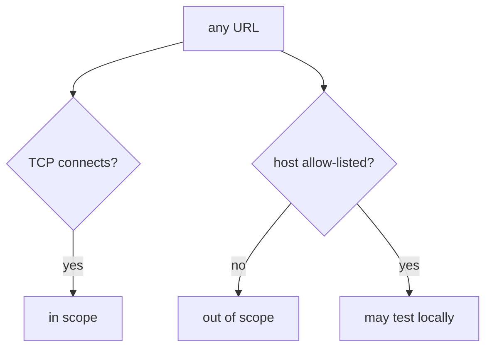
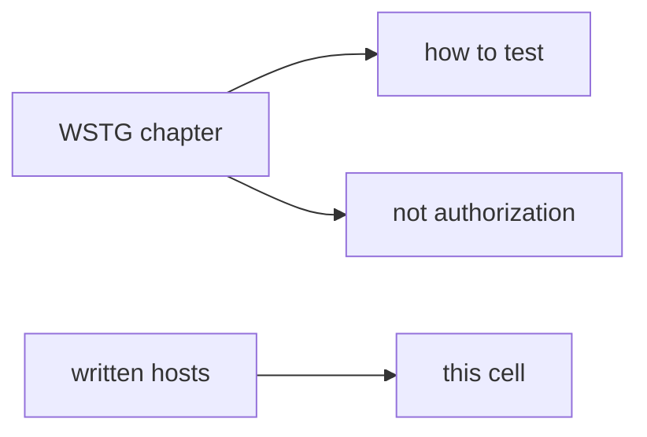

# 0.1-LO-01 — Reachability is not authorization

**Kind:** concept-model
**Loop step:** 1 Property
**Standards:** NIST CSF 2.0 (final) GV/ID. OWASP WSTG 4.2 (final) as *lab method*, not a licence. NIST SP 800-181r1 NICE (final) as role language. WCAG 2.2 (final).

## The claim this module owns

This course tests **SecureCollab labs** and named official training apps. **Authorization of the tester** is whether the host is on the written allow-list. TCP connecting is not that check.

> `target_is_authorized("https://example.com/")` must be false. `http://127.0.0.1:8000/notes` may be true.

The forbidden outcome is **HTTP to a non-allowlisted host treated as authorized**. That is both a legal failure and an engineering failure (safety + accountability in 1.1).

CSF GV is governance language, not a pentest permit. WSTG 4.2 names *how* to test an **in-scope** app. NICE work roles name jobs; they do not authorize a scan. Burp, ZAP, or curl existing is a tool, not a grant.

## Mental model: connect vs allow-list



## Mental model: WSTG is not a licence



**Mechanism (not the property):** robots.txt; a recruiter staging URL; “it has a login page.”

## Root cause vs impact vs prevention vs detection vs recovery

| Slice | For this property |
|---|---|
| Root cause | Authorization collapsed into reachability |
| Preconditions | Proxy in hand; public URL one paste away |
| Trigger | Tired paste of a blog host |
| Impact | Unauthorized testing — legal, expulsion, harm to uninvolved operators |
| Prevention | Allow-list local names; fail closed; written scope |
| Detection | Denied-host log without fetching |
| Recovery | Stop; document; notify instructor; do not continue |

## Framework defaults versus the scope guarantee

A proxy will open whatever you type. That is the bug class, not the property.

## Mechanism limits

- `/etc/hosts` aliases; DNS rebinding; redirects off localhost.
- Official Juice Shop **on your machine** is OK; a random cloud Juice Shop you do not own is not.

## Usability and accessibility

Scope templates and stop-buttons must be keyboard-operable (WCAG 2.2). A mouse-only “I agree” is not informed consent.

## Practice

Write a three-line scope: in, out, stop condition. Then run:

```
python3 -m pytest labs/0.1/0.1-orientation/tests --impl vulnerable
python3 -m pytest labs/0.1/0.1-orientation/tests --impl fixed
```

The first command must fail. The second must pass. Do not fetch example.com; the test string is enough.

## Transfer

Company staging URL: what **written** artifact would make it in-scope? Contractor asked to test a customer WordPress.

## Residual risk

Hosts-file tricks; redirect chains. Gate 0 stays not-attempted until Phase 0 evidence exists.

## Non-goals

Live targets. WSTG as the syllabus. Weaponized payloads.
