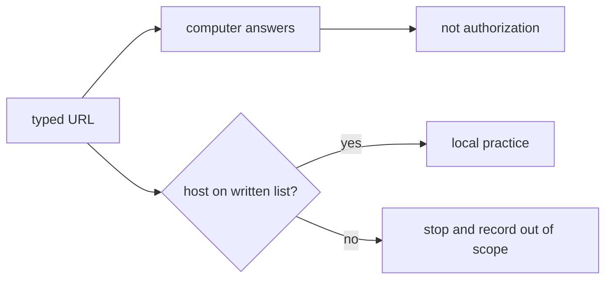

# Connecting is not permission

**Kind:** concept-model
**Loop step:** 1 Property

## Your first action

This course teaches you to protect a small notes app used by more than one company. You will write rules, break local practice files, repair them, and keep evidence another engineer can check. Practice only on the repository's local fixtures or an official training app you own.

A computer answering is not permission to test it. `https://example.com/` is a public string in a local test; do not fetch it. The property is:

> A host is testable only when it is named in the written allow-list.

## Check yourself

Before moving on, write three lines:

1. The local host or official training app you are allowed to use.
2. The host or system you will not touch.
3. The event that makes you stop, such as an unknown host or redirect.

**Feedback:** “It has a login page,” “a testing guide mentions it,” and “my proxy can reach it” are not written authorization. If you cannot name the allowed host, stop and ask for scope.
