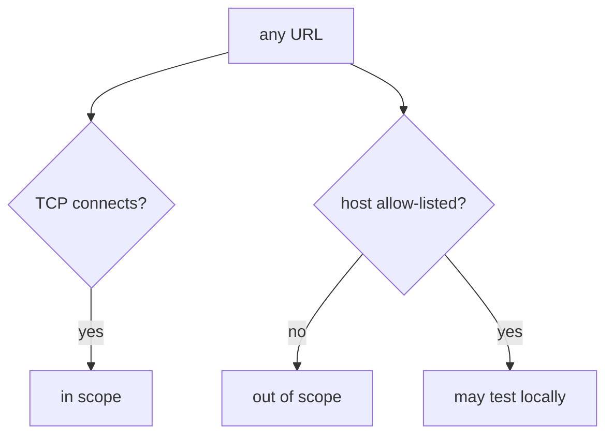
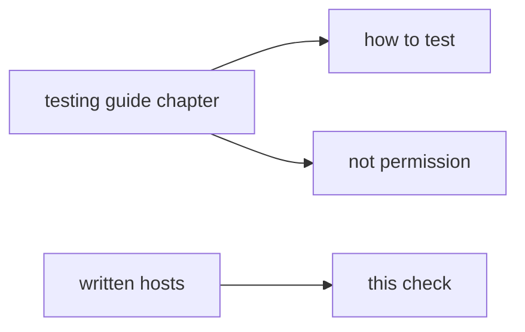

# Connecting is not permission

**Kind:** concept-model
**Loop step:** 1 Property
**Standards:** NIST CSF 2.0 (final) GV/ID. OWASP WSTG 4.2 (final) as *lab method*, not a licence. NIST SP 800-181r1 NICE (final) as role language. WCAG 2.2 (final).

## The rule

This course lets you practice on **the notes-app files** and on named official training apps. You are allowed to test a host only if it is on the written list. The fact that a computer answers is not that permission.

> `target_is_authorized("https://example.com/")` must be false. `http://127.0.0.1:8000/notes` may be true.

What must not happen: treating a visit to a host that is not on the list as allowed. That is both a legal problem and an engineering problem.

A testing guide tells you *how* to test an app that is already in scope. A job-title list names jobs. A proxy existing on your laptop is a tool. None of those is permission to hit a public website.

## Picture: connect vs allow-list



## Picture: a testing guide is not a licence



**Mechanism (not the property):** robots.txt; a recruiter staging URL; “it has a login page.”

## Why it happens, what it costs, how you stop it, how you notice, how you recover

| Slice | For this rule |
|---|---|
| Why it happens | Permission got mixed up with “the computer answered” |
| What has to be true first | You have a proxy; a public URL is one paste away |
| Trigger | A tired paste of a blog host |
| What it costs | Unauthorized testing — legal trouble, expulsion, harm to people who did not ask |
| How you stop it | A written list of local names; if you are unsure, say no |
| How you notice | A denied-host log, without fetching the page |
| How you recover | Stop; write it down; tell the instructor; do not continue |

## What the framework does vs what you still have to check

A proxy will open whatever you type. That is the bug class, not the rule.

## What the tool cannot do

- A hosts-file alias, DNS tricks, or a redirect off localhost can still confuse you.
- Official Juice Shop **on your machine** is fine. A random cloud Juice Shop you do not own is not.

## Can people still use it

Scope templates and the stop button must work from the keyboard. A mouse-only “I agree” is not informed consent.

## Practice

Write three lines: what is in, what is out, and when you stop. Then run this check:

```
python3 -m pytest labs/0.1/0.1-orientation/tests --impl vulnerable
python3 -m pytest labs/0.1/0.1-orientation/tests --impl fixed
```

The first command must fail. The second must pass. Do not fetch example.com; the test string is enough.

## Use it somewhere new

A company staging URL: what **written** artifact would put it on the list? A contractor asked to test a customer WordPress.

## What can still go wrong

Hosts-file tricks; redirect chains. Opening this page does not finish the first check-in.

## What this page is not doing

Live targets. Treating a “top ten bugs” list as the course. Ready-made attack recipes.
