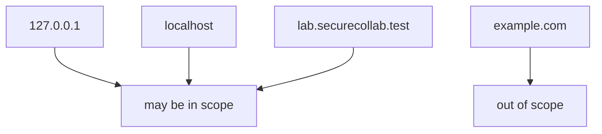
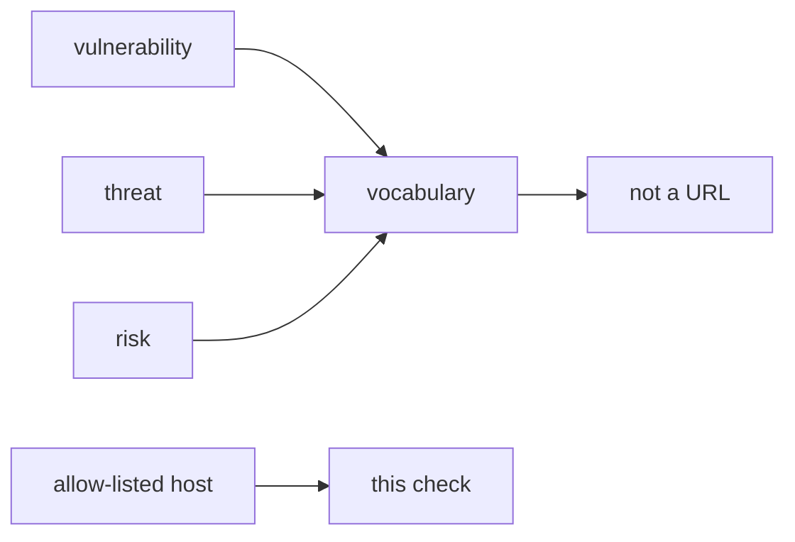

# In-scope hosts vs when you stop

**Kind:** design-exercise
**Loop step:** 2 Model
**Standards:** CSF 2.0 GV. WSTG 4.2 as method list.

## Can a second person name the host check from your scope sheet?

“I’ll be careful” is not this lesson. A reviewable picture names **allowed hosts, when you stop, and what you do not fetch**.

For the notes app: a local `target_is_authorized(url)` helper. Do not open example.com.

## Picture: three named hosts

## Picture: vocabulary is not a target list

## Step 1: name the pieces

| Piece | This system |
|---|---|
| Subjects | you with a proxy; your future tired self |
| Objects | practice apps; uninvolved public operators |
| Actions | `target_is_authorized` |
| Channels | a typed URL; a redirect |
| What you trust | the written allow-list |
| What you do not trust | any other host; blog snippets |
| State / time | stop when a redirect leaves the list |
| The rule | permission of the tester |

## Step 2: write the rules

| Subject | Object | Action | Decision |
|---|---|---|---|
| you | example.com | GET | deny |
| you | 127.0.0.1 lab | GET | may allow |
| a testing-guide chapter | public host | treat as in-scope | deny |
| cloud Juice Shop | third-party | test | deny |

## Practice

In `labs/0.1/0.1-orientation`, mark `scope.py`.

## Use it somewhere new

Written permission for company staging vs a Slack thumbs-up.

## What can still go wrong

Redirects; hosts-file aliases.

## What this page is not doing

A “top ten bugs” list as the definition of security. Answer keys are not on this site.
