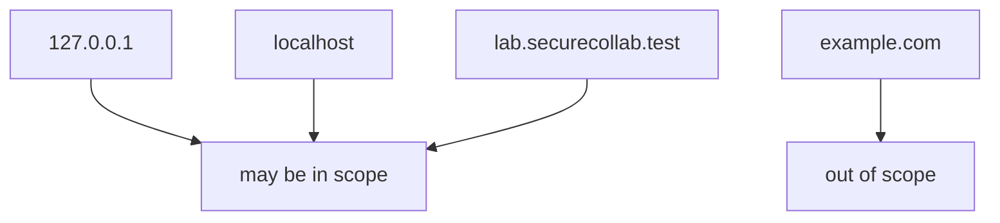
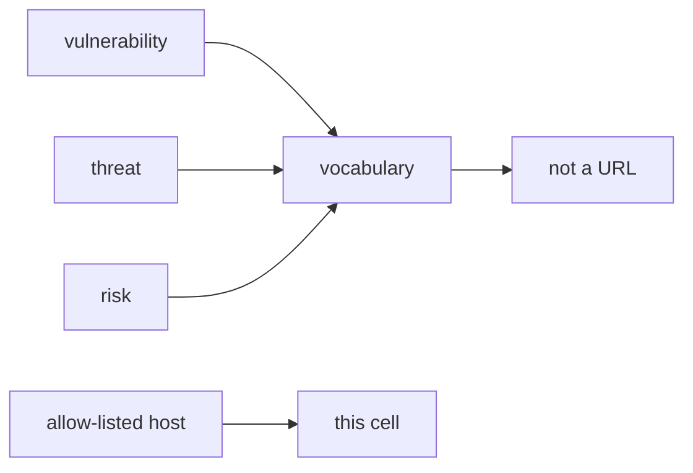

# 0.1-LO-02 — In-scope hosts vs stop condition

**Kind:** design-exercise
**Loop step:** 2 Model
**Standards:** CSF 2.0 GV. WSTG 4.2 as method catalogue.

## Can a second engineer name the host check from your scope sheet?

“I’ll be careful” is not this lesson. A reviewable model names **allowed hosts, stop condition, and what you do not fetch**.

SecureCollab freeze: local `target_is_authorized(url)`. Do not open example.com.

## Mental model: three named hosts

## Mental model: vocabulary is not a target list

## Step 1: freeze pieces

| Piece | This system |
|---|---|
| Subjects | learner with a proxy; future tired self |
| Objects | lab apps; uninvolved public operators |
| Actions | `target_is_authorized` |
| Channels | typed URL; redirect |
| TCB | written allow-list |
| Untrusted | any other host; blog snippets |
| State / time | stop when redirect leaves allow-list |
| 1.1 cell | authorization of the tester |

## Step 2: write cells

| Subject | Object | Action | Decision |
|---|---|---|---|
| learner | example.com | GET | deny |
| learner | 127.0.0.1 lab | GET | may allow |
| WSTG chapter | public host | treat as in-scope | deny |
| cloud Juice Shop | third-party | test | deny |

## Practice

Draw the map. Point at `labs/0.1/0.1-orientation` file `scope.py`.

## Transfer

Written authorization for company staging vs a Slack thumbs-up.

## Residual risk

Redirects; hosts-file aliases.

## Non-goals

Top 10 as the definition of security. Keys stay out of lessons.
