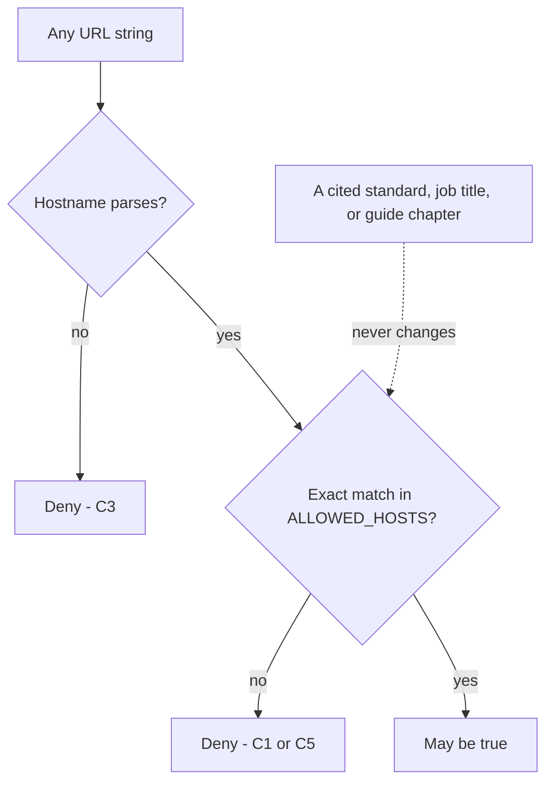

# In-scope hosts, the stop condition, and what a name is not

**Kind:** design-exercise
**Loop step:** 2 Model

## Naming the pieces before drawing anything

A model earns its diagram only after the pieces it draws have precise names, and this module's model is small enough that skipping the naming step is tempting — which is exactly why it is worth doing carefully here, before later modules make the same skipping look normal on a harder system. The actors in this model are a learner running this course's labs, possibly tired, possibly mid-tutorial with a proxy already pointed somewhere; a future version of that same learner who does not remember exactly what they were testing an hour ago; and, implicitly, every operator of every host that is not on the allow-list, none of whom has agreed to anything. The object being protected is not a server or a database; it is a fact — whether a given hostname has been granted testing permission — and the only action this module's system performs on that object is a single yes-or-no check, `target_is_authorized(url)`. The channel the check receives its input on is a URL string, typed, pasted, or generated by earlier code; nothing about that channel guarantees the string names a real, resolvable, or even syntactically valid host, which is exactly why the check has to handle failure to parse as its own outcome rather than assuming a string arrived in good shape.

What this system trusts is deliberately small: a Python set literal, `ALLOWED_HOSTS`, written into source code and reviewed the way any other code change is reviewed. What it does not trust is everything else that might look like evidence of scope — a proxy being configured, a recruiter's email, a login page rendering correctly, a job title, a testing methodology's table of contents. The state that matters is which of the three written names a given URL's hostname equals, evaluated fresh on every call; there is no session, no cache, and no "we checked this host earlier so it's fine now" — each call answers only for the exact string it received, at the moment it received it. The rule this model exists to support is the one named in the first lesson: a URL is in scope only if a person wrote its hostname into this set, and every other fact about the URL is irrelevant to that determination.

## Three named hosts, and why the fourth is not a fourth

| Host string | Member of `ALLOWED_HOSTS`? | Why |
|---|---|---|
| `127.0.0.1` | Yes | The loopback address every lab in this repository binds to |
| `localhost` | Yes | The loopback name, written separately because it is a different string, not because it is a different address |
| `lab.securecollab.test` | Yes | The one non-numeric name this course's later fixtures use, written down exactly once |
| `evillab.securecollab.test` | No | Ends with `lab.securecollab.test`, but ending with a name is not being that name |

That fourth row is the one worth sitting with, because it is where a plausible-sounding repair goes wrong. Someone repairing `target_is_authorized` for the first time, and reasoning informally about "hosts that look like our lab hosts," might reach for `host.endswith("lab.securecollab.test")` instead of exact-set membership — and that change would pass every test that only exercises the three rows above it, because all three of those hosts do, trivially, end with themselves. It would also silently authorize `evillab.securecollab.test`, `notlab.securecollab.test`, and any other string an attacker or a careless copy-paste happens to construct with the right suffix, because "ends with" and "equals" are different claims that happen to agree on the cases someone is likely to test by hand and disagree on the cases someone is likely to exploit on purpose. This module's lab includes a boundary test built specifically around that gap, and the underlying lesson generalizes past hostnames: **an allow-list entry is a whole word, and a comparison that accepts a superstring of an allowed value has silently widened the allow-list to include something nobody wrote down.**

## An allow-list entry is a whole word

Carry that sentence forward past this module, because the shape of the mistake — mistaking "contains, starts with, or ends with an approved value" for "is an approved value" — recurs anywhere a system compares an untrusted string to a written list: a permitted redirect target, an allowed CORS origin, an approved file extension, a role name checked with a prefix instead of an exact match. In every one of those cases, the fix is the same shape as this one: compare the parsed, canonicalized value to the finite set of values a person actually wrote down, using equality, and treat any input that is merely similar to a member of that set as a non-member until someone deliberately adds it. A model that draws "the allow-list" as one box and "matching" as one arrow is only honest if that arrow is labeled with which comparison it performs, because a diagram that says "checked against the allow-list" is compatible with both the correct fix and the `endswith` mistake, and a reviewer who cannot tell which one a diagram describes has been shown a picture, not a specification.

```python
ALLOWED_HOSTS = {"127.0.0.1", "localhost", "lab.securecollab.test"}

def is_member_correct(host: str) -> bool:
    return host in ALLOWED_HOSTS                       # exact match: the fix

def is_member_wrong(host: str) -> bool:
    return any(host.endswith(a) for a in ALLOWED_HOSTS)  # superstring match: the trap

print(is_member_correct("evillab.securecollab.test"))   # False
print(is_member_wrong("evillab.securecollab.test"))      # True
```

## The picture: two paths meeting at one decision



Two authority paths reach the same decision box in this diagram, and the dotted arrow is the one worth reading twice: it shows a standard, a job title, or a guide chapter arriving at the decision only to be explicitly severed from it, "never changes," rather than omitted from the picture entirely. A diagram that leaves that path out lets a reader imagine it might matter somewhere unlabeled; drawing it and cutting it is a stronger claim than silence.

## Check yourself

- Could a second person, reading only your written scope sheet, correctly compute `target_is_authorized` for `lab.securecollab.test`, `evillab.securecollab.test`, and an unparseable string, without asking you anything?
- Can you state, in one sentence, why `host.endswith(allowed)` and `host == allowed` produce different answers for `evillab.securecollab.test` specifically, and the same answer for `lab.securecollab.test`?
- Can you name the one piece of state this model deliberately does not keep between calls, and say what checking it once and caching the result would cost?

## Practice

Run this only inside `labs/0.1/0.1-orientation/`. The hostnames above are fixture labels, not real infrastructure.

Open `labs/0.1/0.1-orientation/fixed/scope.py` and, without running anything yet, predict the return value of `target_is_authorized` for each row in the table above, plus `"https://evillab.securecollab.test/"`. Then run:

```
python3 -m pytest labs/0.1/0.1-orientation/tests --impl fixed -k lookalike -v
```

Compare the test's actual assertions to your prediction before moving to the next lesson's break.
