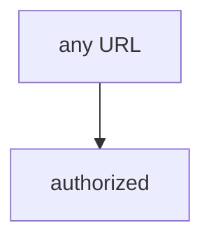

# 0.1-LO-03 — Observe any-URL-true, do not fetch the public host

**Kind:** mechanism-lab
**Loop step:** 3 Break
**Standards:** WSTG 4.2 as method, not a licence. Lab policy: local only.

## Authorized scope

`labs/0.1/0.1-orientation` only. The string `https://example.com/` is a **test literal**. Do **not** send HTTP to example.com, a customer site, or a classmate preview as the exercise.

**Forbidden outcome:** HTTP to a non-allowlisted host treated as authorized.

## Mental model: every URL is in



`--impl vulnerable` returns true for every URL.

## What to read in the fixture

`vulnerable/scope.py` always returns true. Tests require `target_is_authorized("https://example.com/")` is false. Do not open that host.

## Root cause vs impact

| Slice | Lab |
|---|---|
| Root cause | Authorization collapsed into reachability |
| Impact | Unauthorized testing |
| Not the lesson | A WSTG chapter as the definition |

## Practice

```
python3 -m pytest labs/0.1/0.1-orientation/tests --impl vulnerable
```

Record `test_public_host_is_out_of_scope`. Do not probe public hosts.

## Transfer

Contractor WordPress: predict deny without leaving this directory.

## Non-goals

No live-target, customer-site, or public-Juice-Shop instructions.
