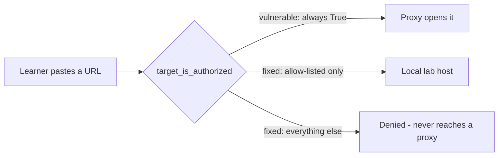

# Watch the broken helper say yes to everything

**Kind:** mechanism-lab
**Loop step:** 3 Break

## The failure, before you look at the code

Picture a learner an hour into this course's first lab, three tabs deep into a walkthrough, with a proxy already configured and pointed at whatever the last exercise used. A notification interrupts them; they switch tabs, read a message from a colleague about a company website, and — without fully registering the switch — paste that company's URL into the field the lab exercise has been using all along. If the function behind that field is `vulnerable/scope.py`'s `target_is_authorized`, nothing distinguishes that paste from any other input, because the function does not look at its argument at all: it returns `True` unconditionally, for every string, parseable or not, local or public, fixture or real. This is the failure this lesson exists to make you watch happen, on purpose, in a place where watching it costs nothing — not the failure of a clever attacker defeating a clever check, but the far more common failure of a check that was never actually wired to check anything.

```python
def target_is_authorized(url: str) -> bool:
    """Vulnerable: any URL is treated as in-scope."""
    return True
```

Read that function slowly, because its entire defect is visible in three lines and easy to miss anyway if you skim past it expecting complexity. There is no `urlparse` call, no comparison, no allow-list, no reference anywhere to the string that was passed in. A caller of this function has been given something that has the *shape* of a permission check — a function named `target_is_authorized`, taking a URL, returning a boolean — without any of the *behavior* one. This is the mechanism this module warns about most directly: a security-shaped name attached to code that does not perform the check the name promises, which is more dangerous than an obviously missing check, because a missing check is at least visibly absent, and a fake one looks, from the outside, exactly like a real one until someone calls it with an input that should fail.

## What a proxy sees vs. what this file checks

A proxy, a browser, and `curl` all share one property relevant here: each of them will faithfully open whatever URL you give it, without asking whether you are supposed to. That is correct behavior for a general-purpose network tool — a browser that refused to load pages based on a guess about your intentions would be a much worse browser — and it is exactly why this course puts the check in a separate, purpose-built function rather than relying on any tool's own judgment. `target_is_authorized` is meant to run *before* a network tool ever sees the URL, denying the ones that should never reach a proxy at all. The vulnerable file breaks that ordering silently: it still runs first, still gets called, still returns a boolean that downstream code treats as a real verdict — it has simply stopped producing a verdict that means anything, while continuing to look, from every caller's perspective, exactly like it always did.



The counterexample worth holding onto here is not `example.com` — that one is almost too easy, since a learner reading this lesson already expects it to be denied and is primed to notice if it is not. The sharper counterexample is `https://example.com:8443/admin`, a URL that differs from the plain domain only in port and path. Nothing about the extra characters makes this string more or less dangerous to the vulnerable check, because the vulnerable check does not look at any characters at all; it returns `True` for this string exactly as fast and exactly as unconditionally as it returns `True` for the bare domain, for `http://127.0.0.1:8000/notes`, and for a string that is not a URL in any recognizable sense whatsoever, such as the literal text `"yes please"`. A check that cannot distinguish `"yes please"` from a real hostname has not merely failed at hostname parsing; it has demonstrated that no part of its logic ever depended on the argument, which is the tell that separates "buggy check" from "absent check wearing a check's name."

## Practice

Run this only inside `labs/0.1/0.1-orientation/`. The string `https://example.com/` below is a test literal that the assertion inspects directly; nothing in this exercise opens a network connection, and nothing here should either.

```
python3 -m pytest labs/0.1/0.1-orientation/tests --impl vulnerable -v
```

Read the failures, not just the summary line. Four of the seven tests should fail: the public-host forbidden outcome, the lookalike-host boundary case, the malformed/non-string case, and the case-and-scheme boundary case. For each failing test, write one sentence stating which specific fact about the vulnerable file's behavior — not "it's broken," but the actual line of reasoning — makes that particular assertion false. Do not weaken any assertion to make it pass, and do not paste any of the test URLs into a browser or a proxy to "double-check" them; the whole point of this exercise is that the string itself is sufficient evidence, and fetching it would itself be the forbidden outcome this module teaches you to avoid.

## Check yourself

- Can you explain why `vulnerable/scope.py` passing the two normal-case tests (the local hosts) is not evidence that the function works, given what you now know about how it is written?
- Can you name a single input the vulnerable function would deny? If the honest answer is "none," say what that tells you about the difference between "returns booleans" and "makes a decision."
- Predict, before running it, what `--impl vulnerable` will do with a malformed URL like `"http://[::1/path"` — and say why your prediction differs from what the *fixed* file has to do with the same input.

## Use it against a new scenario

A contractor asked to "quickly test our customer's WordPress" is one paste away from the same failure this lesson just walked through, if the check standing between "an interesting URL arrived" and "a request went out" has quietly become a function that always says yes. Predict, without leaving this lab, what a `target_is_authorized`-shaped check should return for that customer's hostname, and name the one fact that would have to exist in writing before that answer could honestly change.
