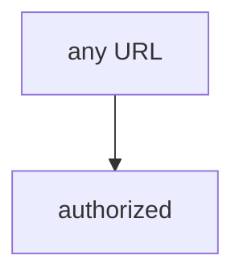

# Watch the broken helper say yes to every URL

**Kind:** mechanism-lab
**Loop step:** 3 Break
**Standards:** NIST CSF 2.0 (final) GV as governance language, not a pentest permit; OWASP WSTG 4.2 (final) as *method*, not a licence. Lab policy: local only.

## Where you may practice

`labs/0.1/0.1-orientation` only. The practice files check a function called `target_is_authorized`. They do not open a network connection. The string `https://example.com/` is a **test literal**. Do **not** send HTTP to example.com, a customer site, a classmate preview, a recruiter staging URL, or a cloud Juice Shop you do not own.

`target_is_authorized("https://example.com/")` returning true is the off-list host counted as allowed.

Picture a tired learner with a proxy who can paste any URL — “it has a login page,” “robots.txt allowed it,” or “the guide has a chapter on authorization.” The helper compares the hostname to a written list. A proxy, a scanner, a job title, and “it connected” are not that list.

## Picture: every URL is in



`--impl vulnerable` returns true for every URL. Permission got mixed up with “the computer answered” — not a scan of a public host. You do not need to fetch the host. You must not fetch the host.

A testing guide names *how* to test an **in-scope** app. It does not put `example.com` on the list.

## What to read in the practice files

`vulnerable/scope.py` `target_is_authorized` always returns `True`. Checks:

- `test_localhost_lab_is_in_scope` — `http://127.0.0.1:8000/notes` may be true (honest local practice)
- `test_public_host_is_out_of_scope` — `https://example.com/` must be false

Do not paste the public host into a browser or proxy.

## Why it happens, what it costs, how you stop it, how you notice, how you recover

| Slice | This practice |
|---|---|
| The rule | Hosts not on the list are not allowed |
| Why it happens | Permission collapsed into “the computer answered” (or into “any string is in”) |
| What's already wrong | A proxy in hand; a public URL one paste away |
| Trigger | `target_is_authorized("https://example.com/")` |
| What it costs | Unauthorized testing — legal trouble, expulsion, harm to uninvolved operators |
| How you stop it | Parse the hostname; allow-list local names; if you are unsure, say no |
| How you notice | A denied-host log without fetching; an `out_of_scope` count |
| How you recover | Stop; write it down; tell the instructor; do not continue |
| Not the lesson | A guide chapter as the definition, a job title, or “I’ll be careful” |

## What the framework does vs what you still have to check

A proxy will open whatever you type. That is the bug class, not the rule. robots.txt, a login page, and “it connected” are tools. The guarantee here is: **these** files, `example.com` → false.

## Practice

```text
python3 -m pytest labs/0.1/0.1-orientation/tests --impl vulnerable
```

Write down the failing check `test_public_host_is_out_of_scope`. Do not weaken the assertion. Do not probe public hosts. A setup error is not proof the rule holds.

## Use it somewhere new

A contractor asked to “quickly test our customer’s WordPress.” Predict deny without leaving this folder. Do not fetch the WordPress.

## Can people still use it

Scope templates and the stop button must work from the keyboard. A mouse-only “I agree” is not informed consent.

## What this page is not doing

No live-target, customer-site, or public-Juice-Shop instructions. Fake URL strings only.
