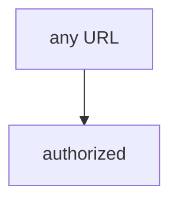

# 0.1-LO-03 — Observe any-URL-true, do not fetch the public host

**Kind:** mechanism-lab
**Loop step:** 3 Break
**Standards:** NIST CSF 2.0 (final) GV as governance language, not a pentest permit; OWASP WSTG 4.2 (final) as *method*, not a licence. Lab policy: local only.

## Authorized scope

`labs/0.1/0.1-orientation` only. The fixture is an in-process `target_is_authorized` predicate. It does not open a socket. The string `https://example.com/` is a **test literal**. Do **not** send HTTP to example.com, a customer site, a classmate preview, a recruiter staging URL, or a cloud Juice Shop you do not own.

**Forbidden outcome:** HTTP to a non-allowlisted host treated as authorized. `target_is_authorized("https://example.com/")` returns true.

Attacker capability in this lab: a tired learner with a proxy who can paste any URL. That stands in for “it has a login page,” “robots.txt allowed it,” or “WSTG has an authorization chapter.” Trust assumption: the helper is supposed to compare the hostname to a written allow-list. Burp, ZAP, curl, NICE work-role fluency, and TCP connecting are not in the TCB for this cell.

## Mental model: every URL is in



`--impl vulnerable` returns true for every URL. The vulnerable tree demonstrates **cause** (authorization collapsed into reachability), not a trophy scan of a public host. Preconditions: a URL string; a helper that returns `True` without parsing the host. You do not need to fetch the host. You must not fetch the host.

CSF GV is governance language. WSTG 4.2 names *how* to test an **in-scope** app. Neither sentence authorizes `example.com`.

## What to read in the fixture

`vulnerable/scope.py` `target_is_authorized` always returns `True`. Tests:

- `test_localhost_lab_is_in_scope` — `http://127.0.0.1:8000/notes` may be true (honest local lab)
- `test_public_host_is_out_of_scope` — `https://example.com/` must be false

You do not need a new URL. The failure of `test_public_host_is_out_of_scope` *is* the evidence.

Do not open the fixed tree yet. Diagnose the cause first. Do not paste the public host into a browser or proxy.

## Root cause vs impact vs prevention vs detection vs recovery

| Slice | This lab |
|---|---|
| Required property | Non-allowlisted hosts are not authorized |
| Root cause | Authorization collapsed into reachability (or into “any string is in”) |
| Preconditions | Proxy in hand; public URL one paste away |
| Trigger | `target_is_authorized("https://example.com/")` |
| Impact | Unauthorized testing — legal, expulsion, harm to uninvolved operators |
| Prevention | Parse hostname; allow-list local names; fail closed |
| Detection | Denied-host log without fetching; `out_of_scope` metric |
| Recovery | Stop; document; notify instructor; do not continue |
| Not the lesson | A WSTG chapter as the definition, a NICE work-role name, or “I’ll be careful” |

## Framework defaults versus the scope guarantee

A proxy will open whatever you type. That is the bug class, not the property. robots.txt, a login page, and “it connected” are mechanisms. The application guarantee is: **this** fixture, `example.com` → false.

## Practice

```text
python3 -m pytest labs/0.1/0.1-orientation/tests --impl vulnerable
```

Record the failing test `test_public_host_is_out_of_scope`. Do not weaken the assertion. Do not probe public hosts. An environment error is not security evidence.

## Transfer

Contractor asked to “quickly test our customer’s WordPress.” Predict deny without leaving this directory. Do not fetch the WordPress.

## Usability

Scope templates and stop-buttons must be keyboard-operable (WCAG 2.2). A mouse-only “I agree” is not informed consent.

## Non-goals

No live-target, customer-site, or public-Juice-Shop instructions. Synthetic URL strings only.
