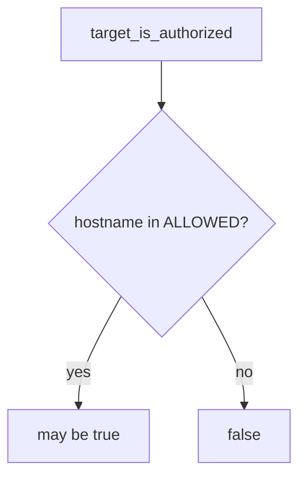

# 0.1-LO-04 — Allow-list named local lab hosts

**Kind:** design-exercise
**Loop step:** 4 Build
**Standards:** CSF 2.0 GV. WCAG 2.2 for stop UI.

## Structural means the runtime compares the host

`target_is_authorized` must parse the hostname and return true only if it is in `{127.0.0.1, localhost, lab.securecollab.test}`. Fail-safe: unknown hosts deny. WSTG may *accompany* testing of an in-scope app; it does not enlarge the list.

## Mental model: host gate



Do not accept “I can ping it” as membership.

## Why this restores the cell

| After the fix | Must be true |
|---|---|
| example.com | false |
| 127.0.0.1 lab | may be true |

## What this is not

Burp. NICE work-role fluency. Gate 0 complete. A cloud Juice Shop you do not own.

If a redirect leaves the allow-list, **stop**. Do not follow it “just to see.”

## Practice

Name the stop condition. Run:

```
python3 -m pytest labs/0.1/0.1-orientation/tests --impl fixed
```

Must pass.

## Transfer

Company staging: require a written artifact, then a named host, the same way.

## Residual risk

Hosts-file aliases; DNS rebinding; redirect chains.
