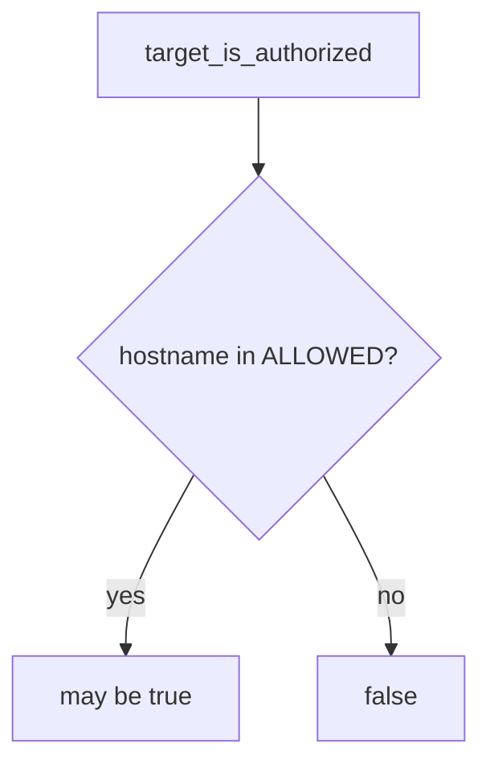

# Allow only named local hosts

**Kind:** design-exercise
**Loop step:** 4 Build
**Standards:** NIST CSF 2.0 (final) GV; WCAG 2.2 for stop UI. WSTG 4.2 may *accompany* testing of an in-scope app; it does not enlarge the list.

## The helper has to compare the host

`target_is_authorized` must parse the hostname and return true only if it is in `{127.0.0.1, localhost, lab.securecollab.test}`. That means the helper actually branches on the parsed host — not a comment “be careful,” not a guide chapter title, not “a proxy is installed,” not a mouse-only I-agree checkbox.

The smallest repair for tester permission in this course is: unknown hosts are denied. If the URL cannot be parsed, deny. A testing guide is a method list for a target that is already allowed. Job titles name jobs; they do not add hosts.

## Picture: host gate



The repaired files use `urlparse` and a set of local names. Do not treat “I can ping it” as membership. Do not treat a recruiter staging URL, a classmate preview, or a cloud Juice Shop you do not own as `lab.securecollab.test`.

If a redirect leaves the list, **stop**. Do not follow it “just to see.” That leftover risk is not solved by this check; write it down.

## Why this fix works

| After the fix | Must be true |
|---|---|
| `https://example.com/` | false |
| `http://127.0.0.1:8000/notes` | true |
| Unparseable or empty host | deny (if you are unsure, say no) |

## What this is not

A proxy product. Fluency with a job-title list. The first check-in finished. A cloud Juice Shop you do not own. robots.txt. A login page. A testing guide as a licence. Hosts-file aliases and DNS tricks remain leftover risk — this helper compares the name in the string, not the address after lookup.

## What the tool cannot do

- `/etc/hosts` can make a public name resolve to 127.0.0.1; the string still names a public host — deny on the name you were given, and treat aliases as leftover risk.
- Redirect chains can leave localhost after a 302; this check does not follow redirects.
- Official Juice Shop **on your machine** is OK; a random cloud instance you do not own is not.

## Practice

Name the stop condition (a redirect leaves the list, or the host is not in the set). Run:

```text
python3 -m pytest labs/0.1/0.1-orientation/tests --impl fixed
```

Must pass.

## Use it somewhere new

Company staging: require a written artifact, then a named host, the same way. A contractor WordPress without that artifact stays false.

## What can still go wrong

Hosts-file aliases; DNS tricks; redirect chains; a mouse-only consent screen.

## Can people still use it

The stop control must work from the keyboard. Do not “fix” scope by hiding the deny behind a color-only badge.
