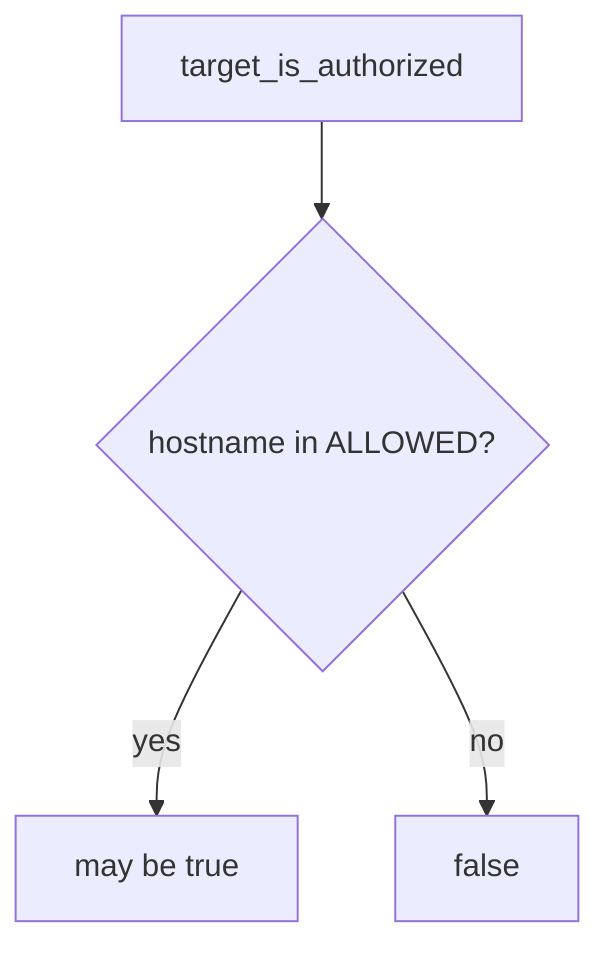

# 0.1-LO-04 — Allow-list named local lab hosts

**Kind:** design-exercise
**Loop step:** 4 Build
**Standards:** NIST CSF 2.0 (final) GV; WCAG 2.2 for stop UI. WSTG 4.2 may *accompany* testing of an in-scope app; it does not enlarge the list.

## Structural means the runtime compares the host

`target_is_authorized` must parse the hostname and return true only if it is in `{127.0.0.1, localhost, lab.securecollab.test}`. Structural means the helper actually branches on the parsed host—not a comment “be careful,” not a WSTG chapter title, not “Burp is installed,” not a mouse-only I-agree checkbox.

The smallest restore for this course’s tester authorization is: unknown hosts deny. Fail-safe: if the URL cannot be parsed, deny. WSTG is a method catalogue for an already-authorized target. NICE work roles name jobs; they do not add hosts.

## Mental model: host gate



The fixed tree uses `urlparse` and a set of local names. Do not accept “I can ping it” as membership. Do not treat a recruiter staging URL, a classmate Vercel preview, or a cloud Juice Shop you do not own as `lab.securecollab.test`.

If a redirect leaves the allow-list, **stop**. Do not follow it “just to see.” That residual is not solved by this pytest; write it down.

## Why this restores the cell

| After the fix | Must be true |
|---|---|
| `https://example.com/` | false |
| `http://127.0.0.1:8000/notes` | true |
| Unparseable or empty host | deny (fail closed; residual if the fixture still assumes a host) |

CSF GV wants governance of who may test what. The lab is that sentence for a URL string, not a corporate ROE PDF.

## What this is not

Burp. NICE work-role fluency. Gate 0 complete. A cloud Juice Shop you do not own. robots.txt. A login page. WSTG as a licence. `/etc/hosts` aliases and DNS rebinding remain residuals—this helper compares the name in the string, not the address after resolution.

## Mechanism limits

- `/etc/hosts` can make a public name resolve to 127.0.0.1; the string still names a public host—deny on the name you were given, and treat aliases as a residual.
- Redirect chains can leave localhost after a 302; this predicate does not follow redirects.
- Official Juice Shop **on your machine** is OK; a random cloud instance you do not own is not.

## Practice

Name the stop condition (redirect leaves allow-list, or host not in the set). Run:

```text
python3 -m pytest labs/0.1/0.1-orientation/tests --impl fixed
```

Must pass.

## Transfer

Company staging: require a written artifact, then a named host, the same way. A contractor WordPress without that artifact stays false.

## Residual risk

Hosts-file aliases; DNS rebinding; redirect chains; mouse-only consent UI (1.4).

## Usability

The stop control must be keyboard-operable. Do not “fix” scope by hiding the deny behind a color-only badge (WCAG 2.2 Success Criterion 1.4.1).
