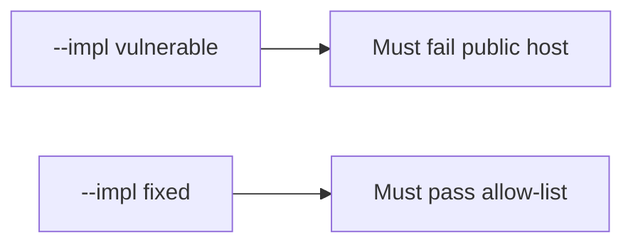

# The public host must be denied

**Kind:** verification-lab
**Loop step:** 5 Verify
**Standards:** WSTG 4.2 as catalogue, not the oracle; CSF 2.0 GV as outcome language.

## Until you can fail it, it is still a slogan

“I’ll be careful” is not evidence. “The guide has an authorization chapter” is a catalogue observation. The check is: `target_is_authorized("https://example.com/")` is false. That must be **false** on `--impl vulnerable` (the helper returns true) and **true** on `--impl fixed`. Do not fetch example.com; the test string is enough.

## Picture: the broken files must fail on the public host

The failing observation on `--impl vulnerable` is **public host**. A passing collection count is not this check.



| Mode | Must show for this topic |
|---|---|
| Normal | After the fix, `http://127.0.0.1:8000/notes` may still be true |
| The bad case | `example.com` → false; the broken files must fail that assertion |
| Failure | An unparseable host denies (leftover if not in this check) |
| Not claimed | Following redirects is safe; `/etc/hosts` cannot lie; the first check-in is done; a testing-guide dashboard is green |

The checks live in `labs/0.1/0.1-orientation/tests/test_scope.py`. The second one exists so a public host treated as allowed cannot count as a pass.

```text
python3 -m pytest labs/0.1/0.1-orientation/tests --impl vulnerable
python3 -m pytest labs/0.1/0.1-orientation/tests --impl fixed
```

Honest localhost tests may pass on both. If the broken files do not fail the public-host assertion, the practice is miswired — fix the wiring, not the assertion.

## What the checks do not prove

- Following redirects is safe
- `/etc/hosts` cannot lie
- DNS tricks are solved
- Written company permission exists
- Guide coverage of an in-scope app
- The first check-in is done

Write those down as leftover risk or later topics, not as silent passes.

## Practice

Run both versions this session. Write the fail/pass pair next to your matrix row. Reject a “test” that only greps `ALLOWED_HOSTS` in a string without calling `target_is_authorized` on the public literal.

## Use it somewhere new

Contractor: a test that only asserts “the guide says authorization testing exists” is not this check. A test that fetches the customer WordPress is out of scope.

## What this page is not doing

Do not add a live GET. Do not store response bodies. Keys stay out of this file. Opening this page does not finish the first check-in.
