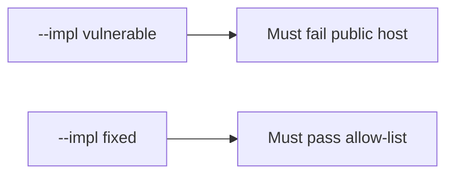

# 0.1-LO-05 — Evidence is public host denied, then a passing pair

**Kind:** verification-lab
**Loop step:** 5 Verify
**Standards:** WSTG 4.2 as catalogue, not the oracle.

## An invariant that cannot fail a test is still a slogan

“I’ll be careful” is not evidence. The oracle is the local pair. Do not fetch example.com.

## Mental model: fail-on-vulnerable, pass-on-fixed



| Case | Must show |
|---|---|
| Negative / abuse | example.com → false |
| Normal | 127.0.0.1 lab may be true |
| Not claimed | WSTG dashboard; Gate 0 |

```
python3 -m pytest labs/0.1/0.1-orientation/tests --impl vulnerable
python3 -m pytest labs/0.1/0.1-orientation/tests --impl fixed
```

Honest localhost tests may pass on both.

## What the tests do not prove

- Redirect following is safe
- `/etc/hosts` cannot lie
- A written company authorization exists

## Practice

Execute both implementations. Map each test to an LO-02 cell.

## Transfer

Contractor: a test that only asserts “WSTG says authorization testing exists” is not this cell.
