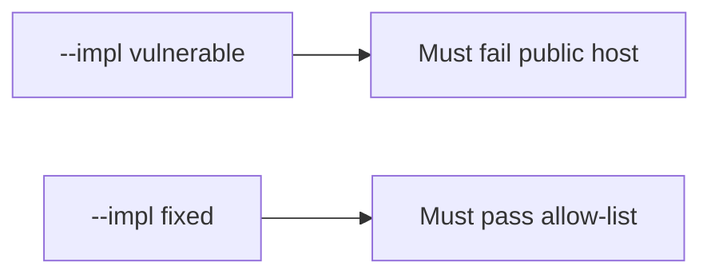

# 0.1-LO-05 — Evidence is public host denied, then a passing pair

**Kind:** verification-lab
**Loop step:** 5 Verify
**Standards:** WSTG 4.2 as catalogue, not the oracle; CSF 2.0 GV as outcome language.

## An invariant that cannot fail a test is still a slogan

“I’ll be careful” is not evidence. “WSTG has an authorization chapter” is a catalogue observation. The oracle is: `target_is_authorized("https://example.com/")` is false. That observation must be **false** on `--impl vulnerable` (the helper returns true) and **true** on `--impl fixed`. Do not fetch example.com; the test string is enough.

## Mental model: vulnerable must fail: public host

The failing observation on `--impl vulnerable` is **public host**. A passing collection count is not this cell.



| Mode | Must show for this module |
|---|---|
| Normal | After the fix, `http://127.0.0.1:8000/notes` may still be true |
| Negative / abuse | `example.com` → false; vulnerable must fail that assertion |
| Failure | Unparseable host denies (residual if not in this pytest) |
| Not claimed | Redirect following is safe; `/etc/hosts` cannot lie; Gate 0 complete; WSTG dashboard green |

Lab tests: `test_localhost_lab_is_in_scope` and `test_public_host_is_out_of_scope` in `labs/0.1/0.1-orientation/tests/test_scope.py`. The second test is a **forbidden-outcome** test: a public host treated as authorized is not allowed to count as a passing control.

```text
python3 -m pytest labs/0.1/0.1-orientation/tests --impl vulnerable
python3 -m pytest labs/0.1/0.1-orientation/tests --impl fixed
```

Honest localhost tests may pass on both. Map each test to an LO-02 cell. If vulnerable does not fail the public-host assertion, the lab is miswired—fix the wiring, not the assertion.

## What the tests do not prove

- Redirect following is safe
- `/etc/hosts` cannot lie
- DNS rebinding is solved
- A written company authorization exists
- WSTG coverage of an in-scope app
- Gate 0 evidence

Record those as residuals or later modules, not as silent passes.

## Practice

Execute both implementations this session. Write the fail/pass pair next to the matrix row. Reject a “test” that only greps `ALLOWED_HOSTS` in a string without calling `target_is_authorized` on the public literal.

## Transfer

Contractor: a test that only asserts “WSTG says authorization testing exists” is not this cell. A test that fetches the customer WordPress is out of scope.

## Non-goals

Do not add a live GET. Do not store response bodies. Keys stay out of this file. Gate 0 stays not-attempted.
