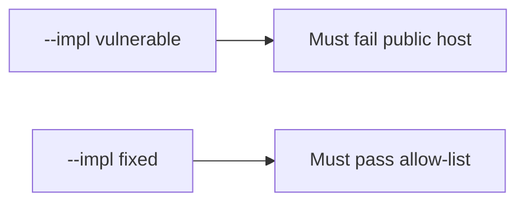

# The public host must be denied

**Kind:** verification-lab
**Loop step:** 5 Verify
**Standards:** WSTG 4.2 as a list, not the check; CSF 2.0 GV as outcome language.

## Check it

Saying you’ll be careful does not authorize the target. An authorization chapter is a heading. `target_is_authorized("https://example.com/")` has to be false. On `--impl vulnerable` the helper returns true. On `--impl fixed` it returns false. Do not fetch example.com; the test string is enough.

## Picture: the broken files must fail on the public host

The failing observation on `--impl vulnerable` is **public host**. Counting passing tests does not show that example.com is denied.



| Mode | Must show for this topic |
|---|---|
| Normal | After the fix, `http://127.0.0.1:8000/notes` may still be true |
| The bad case | `example.com` → false; the broken files must fail that assertion |
| Failure | An unparseable host denies (leftover if not in this check) |
| Not claimed | Following redirects is safe; `/etc/hosts` cannot lie; the first check-in is done; a testing-guide dashboard is green |

The checks are in `labs/0.1/0.1-orientation/tests/test_scope.py`. The second one is there so a public host treated as allowed still fails.

```text
python3 -m pytest labs/0.1/0.1-orientation/tests --impl vulnerable
python3 -m pytest labs/0.1/0.1-orientation/tests --impl fixed
```

A localhost URL that is on the list may pass on both sides. If the broken files do not fail the public-host assertion, the practice is miswired — fix the wiring, not the assertion.

## What the checks do not prove

- Following redirects is safe
- `/etc/hosts` cannot lie
- DNS tricks are solved
- Written company permission exists
- Guide coverage of an in-scope app
- The first check-in is done

## Practice

Call `target_is_authorized` on the public literal. An `ALLOWED_HOSTS` string is the list name, not the public-host deny.

## Use it somewhere new

Contractor: a chapter titled authorization testing is a heading, not the public-host deny. Do not run a test that fetches the customer WordPress.

## What this page is not doing

Do not add a live GET. Do not store response bodies. Keys stay out of this file. Opening this page does not finish the first check-in.
