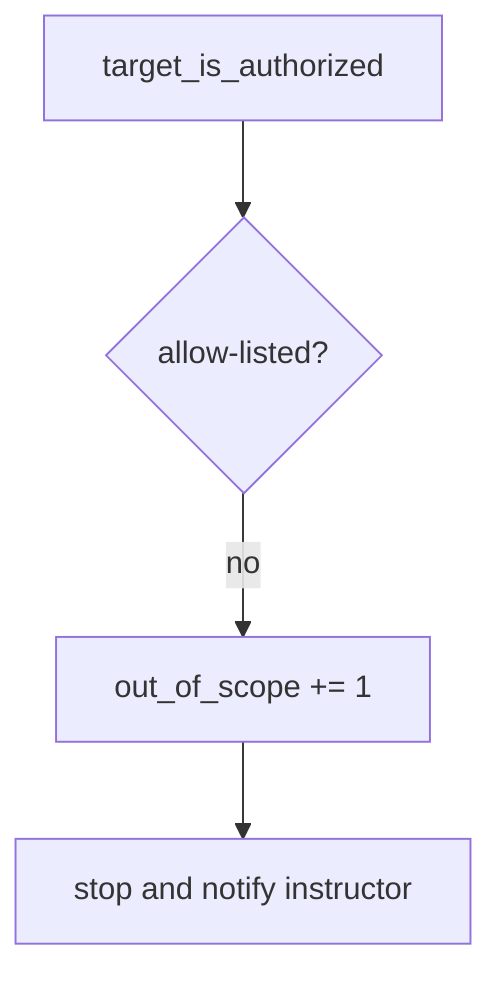

# Notice an out-of-scope host without storing the page

**Kind:** operations-exercise
**Loop step:** 6 Operate
**Standards:** NIST CSF 2.0 (final) DE/RS/RC as outcome labels. CSF names outcomes; it is not a pentest permit.

## Fixing it once is not enough

A new “quick check” snippet can paste a public host after the allow-list was “set once.” Pair noticing with recovery. **Never** store response bodies from denied hosts. Never screenshot a public site “for the ticket.” Never continue after deny.

## Picture: an out-of-scope host is a signal



| Outcome | This topic |
|---|---|
| Notice | Count `out_of_scope` on deny; the check pair is still red/green for the public literal |
| Signal | host, reason; never a response body, never HTML, never a screenshot of a public site |
| Recover | Stop; write it down; tell the instructor; do not continue; do not “just look” |
| Leftover | Redirects; hosts-file aliases; DNS tricks; mouse-only consent |

A scanner product does not write the deny. A deny log does not finish the first check-in.

## What the framework does vs what you still have to check

A proxy, browser, or `curl` will fetch whatever you type and may cache the body. That fetch is the harm this page forbids. Noticing must happen **before** the request, on the hostname string. If you already fetched, stop and treat the body as a leak: do not paste it into chat, tickets, or lesson notes.

## Practice

```text
log_denied reason=out_of_scope host=example.com
```

Reject any line that includes a response body, a screenshot of a public site, a customer URL you were asked to “quickly test,” or “first check-in complete.”

## Use it somewhere new

Contractor WordPress: deny the host; do not paste the customer HTML into the ticket. Recruiter staging without written scope: same deny, same no-body rule.

## Can people still use it

The stop control must work from the keyboard. Color-only “red = out of scope” is not enough.

## What this page is not doing

A scanner sticker does not finish this page. Opening this page does not finish the first check-in. Do not instruct live fetches to prove the deny.
