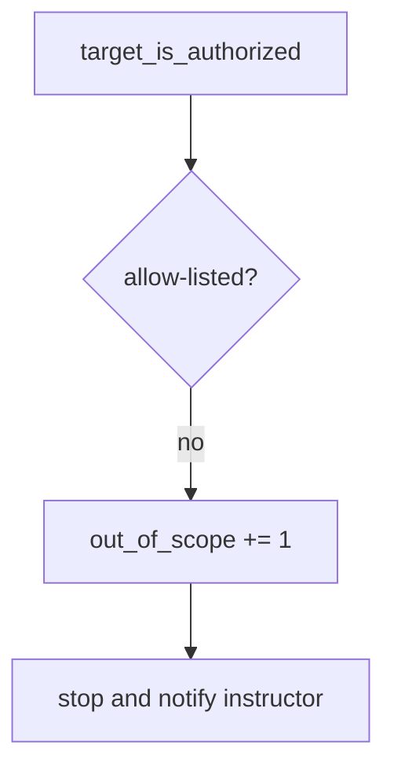

# 0.1-LO-06 — Detect out_of_scope without storing response bodies

**Kind:** operations-exercise
**Loop step:** 6 Operate
**Standards:** NIST CSF 2.0 (final) DE/RS/RC as outcome labels. CSF names outcomes; it is not a pentest permit.

## Prevention is not absolute

A new “quick check” snippet can paste a public host after the allow-list was “set once.” Pair detect and recover. **Never** store response bodies from denied hosts (3.1). Never screenshot a public site “for the ticket.” Never continue after deny.

## Mental model: out-of-scope host is a signal



| Outcome | This module |
|---|---|
| Detect | `out_of_scope` on deny; CI pair still red/green for the public literal |
| Signal | host, reason; never response body, never HTML, never a screenshot of a public site |
| Recover | Stop; document; notify instructor; do not continue; do not “just look” |
| Residual | Redirects; hosts-file aliases; DNS rebinding; mouse-only consent |

CSF 2.0 names Detect / Respond / Recover. They do not prove the allow-list. A scanner name is not the property. Gate 0 is not completed by a deny log.

## Framework defaults versus the operate guarantee

A proxy, browser, or `curl` will fetch whatever you type and may cache the body. That fetch is the harm this cell forbids. Detection must happen **before** the request, on the hostname string. If you already fetched, stop and treat the body as a 3.1 leak: do not paste it into chat, tickets, or lesson notes.

## Practice

Write one log line you would accept. Tie it to `labs/0.1/0.1-orientation`.

```text
log_denied reason=out_of_scope host=example.com
```

Reject any line that includes a response body, a screenshot of a public site, a customer URL you were asked to “quickly test,” or “Gate 0 complete.”

## Transfer

Contractor WordPress: deny the host; do not paste the customer HTML into the ticket. Recruiter staging without written scope: same deny, same no-body rule.

## Usability

The stop control must be keyboard-operable (WCAG 2.2). Color-only “red = out of scope” is not enough (Success Criterion 1.4.1).

## Non-goals

A scanner name is not the property. Gate 0 stays not-attempted. Do not instruct live fetches to prove the deny.
