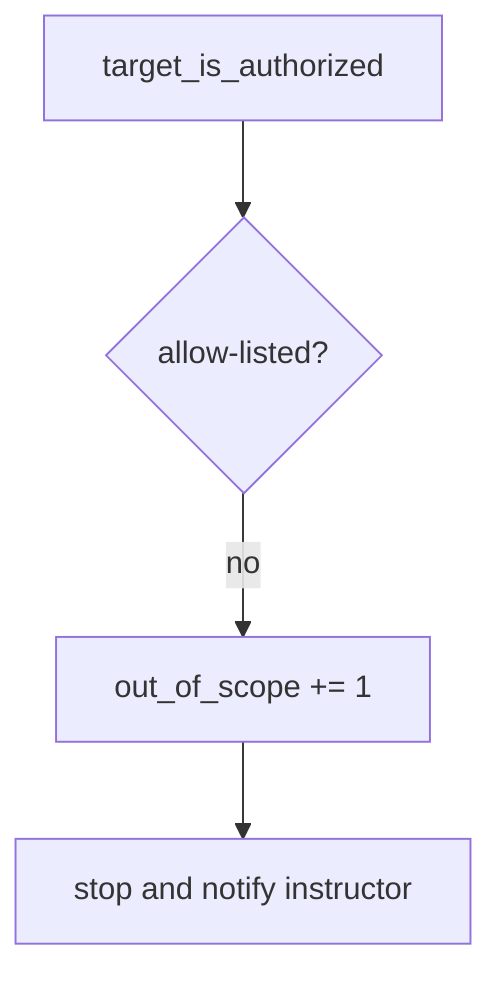

# 0.1-LO-06 — Detect out_of_scope without storing response bodies

**Kind:** operations-exercise
**Loop step:** 6 Operate
**Standards:** NIST CSF 2.0 (final) DE/RS/RC as outcome labels.

## Prevention is not absolute

A new “quick check” snippet can paste a public host after the allow-list was “set once.” Pair detect and recover. **Never** store response bodies from denied hosts (3.1).

## Mental model: denied host is a signal



| Outcome | This module |
|---|---|
| Detect | `out_of_scope` |
| Signal | host, reason; never response body |
| Recover | Stop; document; notify instructor |
| Residual | Redirects; hosts-file aliases |

## Practice

Write one log line you would accept. Tie it to `labs/0.1/0.1-orientation`.

```
log_denied reason=out_of_scope host=example.com
```

Reject any line that includes a response body, a screenshot of a public site, or “Gate 0 complete.”

## Transfer

Contractor WordPress: deny the host; do not paste the customer HTML into the ticket.

## Non-goals

A scanner name is not the property. Gate 0 stays not-attempted.
