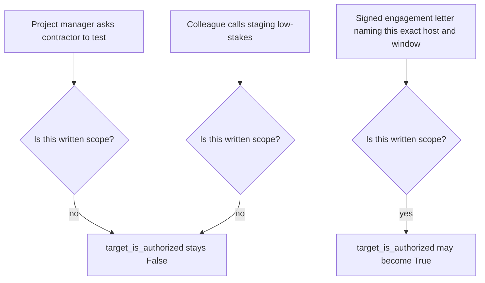

# The contractor, the customer WordPress, and the staging URL

**Kind:** transfer-challenge
**Loop step:** 7 Transfer

## The scenario, stated the way it actually arrives

A contractor working a short-term engagement gets a message from a project manager: "quickly test our customer's WordPress before the handoff call this afternoon." Separately, a teammate proposes pointing the same contractor at a company staging URL, reasoning that "it's not production, so it should be fine to poke at." Neither message names a written scope document, a set of testing dates, or a specific list of allowed hosts — each one is a request, made in good faith, by someone with real authority over the contractor's workload, and neither one is the fact `target_is_authorized` was built to require. This module's entire point was never really about `example.com`; `example.com` was a fixture chosen precisely because nobody could mistake it for a real assignment. This scenario is the version built to feel like a real assignment, because in a real career it eventually will be one.

Work through the same five questions this course's lab-fixture rule already answers for `example.com`, but for these two hosts:

1. **Who might try, and under what pressure?** Not an attacker in the adversarial sense — a contractor under a deadline, asked by someone they report to, with every incentive to be helpful and none of the friction a stranger's suspicious request would create. That combination is precisely what makes an unwritten "just test it" request more dangerous than a cold-call scam: there is no reason for instinctive suspicion, only a missing written fact.
2. **What can this tester actually trust as evidence of scope?** Nothing about either request so far — not the project manager's authority over the contractor's calendar, not the teammate's confidence that staging is low-stakes, not urgency, not a deadline. The only thing this module's rule allows as evidence is a written record, from someone with standing to grant it, naming the specific host.
3. **What must not happen?** `target_is_authorized` returning `True` for either hostname before that written record exists — not "something bad happening," which is a consequence, but the authorization check itself producing the wrong verdict, which is the cause.
4. **What can be reused locally, without touching either real host?** Every reasoning tool this module built: the exact-match table from `lessons/02-model.md`, the fail-closed parse handling from `lessons/04-build.md`, and the `example.com`-shaped literal string this course's own tests already use, substituted for the customer's real domain in any practice exercise, so that reasoning about the rule never requires contacting either host.
5. **What leftover risk remains even after a correct written scope exists?** A redirect from the newly-authorized staging host to a different one; an `/etc/hosts` entry that makes a public name resolve locally without changing what string a written scope document actually named; a cloud-hosted "official training" copy of some tool that the contractor does not personally administer, which this course's own allow-list explicitly treats as different from the same tool running on a machine the tester controls.

The bottom path in the next diagram is not abstract; it has a concrete minimum shape, and naming that shape is what separates "I trust this is fine" from "I checked this against a written fact." A scope artifact this course would treat as satisfying the same rule `target_is_authorized` enforces for `lab.securecollab.test` looks roughly like this, at minimum:

```
Engagement: Acme Corp WordPress security assessment
Authorized hosts: staging-wp.acme-customer.example (exact hostname only)
Testing window: 2026-09-22 through 2026-09-26, 09:00-18:00 customer local time
Authorized testers: [contractor's full name], [contractor's employer]
Signed by: [named individual with authority over the customer's infrastructure]
```

Compare that block to the two requests this scenario opens with, line by line. Neither the project manager's message nor the colleague's staging suggestion names an exact hostname, a bounded window, or a signature from anyone with authority over the *target's* infrastructure rather than the contractor's own workload — which is precisely the gap this module's rule is built to catch, stated now as a checklist rather than only as a feeling that something is missing.

## Picture: two claims of legitimacy, one written fact



Three arrows converge on the same shape of question, and only the bottom path answers yes — not because a project manager or a colleague is untrustworthy, but because organizational trust and written testing scope are different facts, verified by different means, and this diagram's whole argument is that collapsing them is the error, regardless of how reasonable each individual request sounds on its own.

## What sounds like evidence and is not

Three justifications a contractor might reach for, each attractive for a specific, nameable reason, and each rejected for a specific, nameable one. "The WSTG has a whole section on testing WordPress installations, so we clearly have a process for this" mistakes a testing *method* for testing *permission* — WSTG can tell this contractor exactly how to check a WordPress site's authentication once it is in scope, and says nothing about whether this particular customer's site is. "I've done penetration testing professionally for years, this is well within my competence" mistakes the tester's *skill* for the target's *scope* — competence answers whether the work would be done well, not whether it was requested by anyone entitled to request it. "The project manager asked me directly, and they're my point of contact on this engagement" mistakes *organizational authority over the contractor's time* for *the customer's consent to be tested* — a project manager can absolutely direct how a contractor spends an afternoon, and still have no standing at all to grant access to a third party's infrastructure, because that consent belongs to the customer, not to the contractor's own management chain.

## Practice

Do not contact either host named in this scenario, or any host resembling them, over a network connection at any point in this exercise. `labs/0.1/0.1-orientation` is the only running system this module authorizes you to interact with.

Write one page answering the five numbered questions above for both the WordPress request and the staging URL, naming a concrete written artifact for each — not the word "permission" on its own — that would have to exist before `target_is_authorized` could honestly return `True`. Then write one paragraph on the specific leftover risk (question five) you consider most likely to actually occur in this scenario, and why.

## Check yourself

- For each of the three rejected justifications above, can you state which of this module's five claims (C1–C5) it violates, rather than only that it "isn't good enough"?
- Would your answer change if the contractor personally administered the staging environment on their own infrastructure, rather than it belonging to the customer? Say specifically what fact would have changed, using this module's vocabulary rather than a general sense of comfort.
- What is the difference between "I trust this project manager" and "this project manager's request satisfies `target_is_authorized`," and why does this module insist on keeping them separate even when the person asking is entirely trustworthy?
