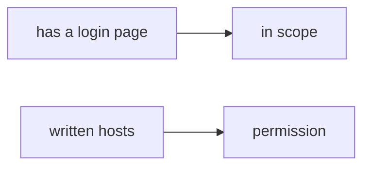

# A contractor asked to test a customer WordPress

**Kind:** transfer-challenge
**Loop step:** 7 Transfer
**Standards:** CSF 2.0 GV. WSTG 4.2 as method, not a licence. NICE as role language, not a permit.

## Change the workplace; keep “it answered” from meaning permission

In this course, `target_is_authorized("https://example.com/")` is false. The same rule has to hold for a workplace paste.

A contractor asked to “quickly test our customer’s WordPress.” Also name a company staging URL.

“It has a login page so it’s a lab,” plus “the guide has an authorization chapter so we can hit it.”

1. who might try (a tired paste of a customer host — **not** an instruction to hit the customer host, the staging URL, or a public login page);
2. what you trust (the written allow-list; not a testing guide, a job title, a proxy, robots.txt, or “it connected”);
3. what must not happen (`target_is_authorized` true for a public or customer host, not merely “unprofessional”);
4. a check idea on **local** files only (do not fetch the WordPress; reuse the `example.com` literal shape);
5. leftover risk (redirects, hosts-file, DNS tricks, a cloud Juice Shop you do not own);
6. if a consent screen exists, it must work from the keyboard, not by color only.

## Picture: login page vs written scope

A login page is a product. Written hosts are the permission check. A testing guide tells you *how* to test after the host is on the list. A job-title list names jobs. Neither enlarges the list.

## What is not good enough

| Reject | Why |
|---|---|
| “The guide / a proxy / a job title” | Not the allow-list |
| Fetch the customer WordPress | Course rules |
| “robots.txt allowed it” | Not permission |
| “I’ll be careful” | Not evidence |
| A cloud Juice Shop you do not own | Not this course’s local official-training exception |

## Practice

Name the WordPress vs staging deny on one page. Keep the answer keys closed. `labs/0.1/0.1-orientation` is the only running system you may break. Do not hit the WordPress, the staging URL, or example.com over the network.

## What this page is not doing

Do not try live-target walkthroughs. This page does not finish the first check-in. Do not use ready-made attack recipes “to demonstrate the guide.”
