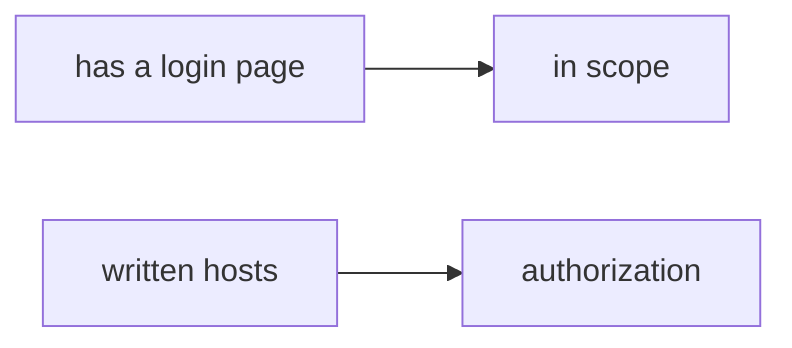

# 0.1-LO-07 — Transfer: contractor asked to test a customer WordPress

**Kind:** transfer-challenge
**Loop step:** 7 Transfer
**Standards:** CSF 2.0 GV. WSTG 4.2 as method, not a licence. NICE as role language, not a permit.

## Change the workplace; keep reachability from meaning authorization

Do not answer with a Top 10 / CWE / scanner as the definition of security. The SecureCollab / course sentence was: `target_is_authorized("https://example.com/")` is false. Rewrite it for a workplace paste without changing the fork.

**Prompt:** A contractor asked to “quickly test our customer’s WordPress.” Also name a company staging URL.

**Product sketch:** “It has a login page so it’s a lab,” plus “WSTG has an authorization chapter so we can hit it.”

Rewrite the course sentence. Include:

1. attacker capabilities (tired paste of a customer host — **not** an instruction to hit the customer host, the staging URL, or a public login page);
2. trust assumptions (written allow-list is TCB; WSTG / NICE / Burp / robots.txt / “it connected” are not);
3. forbidden outcome (`target_is_authorized` true for a public or customer host, not “unprofessional”);
4. a test idea on a **local** fixture only (do not fetch the WordPress; reuse the `example.com` literal shape);
5. residual (redirects, hosts-file, DNS rebinding, cloud Juice Shop you do not own);
6. WCAG if a scope-consent UI exists (keyboard-operable stop; not color-only).

## Mental model: login page vs written scope

A login page is a mechanism observation. Written hosts are the authorization cell. WSTG tells you *how* to test after the host is in the list. NICE names jobs. Neither enlarges the list.

## What graders reject

| Reject | Why |
|---|---|
| “WSTG / Burp / NICE” | Not the allow-list |
| Fetch the customer WordPress | Lab policy |
| “robots.txt allowed it” | Not authorization |
| “I’ll be careful” | Not evidence |
| Cloud Juice Shop you do not own | Not this course’s local official-training exception |

## Practice

One page. No keys. `labs/0.1/0.1-orientation` is the only running system you may break. Do not hit the WordPress, the staging URL, or example.com over the network.

## Non-goals

Live-target walkthroughs. Claiming Gate 0 from this page. Weaponized payloads “to demonstrate WSTG.”
