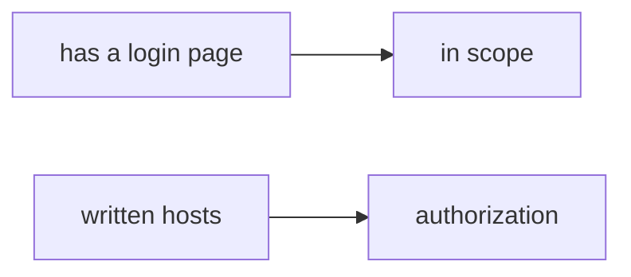

# 0.1-LO-07 — Transfer: contractor asked to test a customer WordPress

**Kind:** transfer-challenge
**Loop step:** 7 Transfer
**Standards:** CSF 2.0 GV. WSTG 4.2 as method, not a licence.

## Change the workplace; keep reachability from meaning authorization

Do not answer with a Top 10 / CWE / scanner as the definition of security.

**Prompt:** A contractor asked to “quickly test our customer’s WordPress.” Also name a company staging URL.

**Product sketch:** “It has a login page so it’s a lab,” plus “WSTG has an authorization chapter so we can hit it.”

Rewrite the SecureCollab sentence. Include:

1. attacker capabilities (tired paste — **not** an instruction to hit the customer host);
2. trust assumptions (written allow-list is TCB; WSTG/NICE/Burp are not);
3. forbidden outcome (`target_is_authorized` true for a public host, not “unprofessional”);
4. a test idea on a **local** fixture only (do not fetch the WordPress);
5. residual (redirects, hosts-file, cloud Juice Shop you do not own);
6. WCAG if a scope-consent UI exists (keyboard-operable stop).

## Mental model: login page vs written scope

## What graders reject

| Reject | Why |
|---|---|
| “WSTG / Burp / NICE” | Not the allow-list |
| Fetch the customer WordPress | Lab policy |
| “robots.txt allowed it” | Not authorization |

## Practice

One page. No keys. `labs/0.1/0.1-orientation` is the only running system you may break. Do not hit the WordPress.
