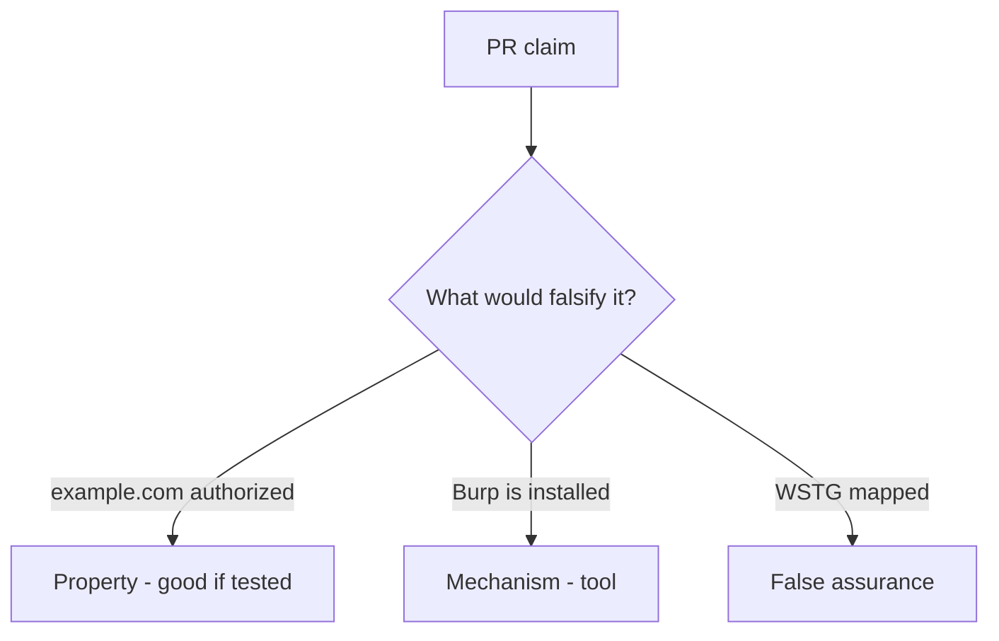

# 0.1-LO-08 — Review any-URL-in-scope as a PR

**Kind:** code-review
**Loop step:** Review
**Standards:** CSF 2.0 GV. WSTG 4.2 as catalogue, not a licence.

## Review the fixture as if it were the course proxy helper

Review `labs/0.1/0.1-orientation/vulnerable/` as a SecureCollab / course-tooling PR. Your job is not to count suspicious lines. Reconstruct whether `target_is_authorized` still returns true for a public host, compare that with the module invariant, and write changes a developer can verify.

Intended findings live only in `content/assessment/keys/0.1.md` — not here. Do not open the keys file until your review has been evaluated.

## Mental model: Any URL the proxy can open

Start with this seeded smell: **Any URL the proxy can open**. Label it property, mechanism, or false assurance before you accept the PR.

Classification starts at the protected effect (public host denied). Everything that is not a hostname allow-list at that call is a candidate ambient path.

## Seeded smells (label them yourself)

- Any URL the proxy can open
- No stop when a redirect leaves 127.0.0.1
- Live-target language in a learner note
- Quiz score treated as permission to scan

Also reject: fetching example.com; keys in lessons; claiming Gate 0; “it has a login page”; robots.txt as authorization; NICE work-role fluency as a permit.

## Misconceptions this module refuses

- If it has a login page it is a lab
- WSTG chapter titles are the syllabus
- Defensive learning requires attacking strangers
- TCP connecting is authorization
- A cloud Juice Shop you found is in-scope because the project is “official training”

## Practice

Write three review notes a maintainer could act on. Each note: observation, property or false assurance, suggested structural change, residual you will **not** delete. Tie at least one to `test_public_host_is_out_of_scope`.

## Transfer

Contractor PR that “added WSTG and Burp” without a host allow-list is an incomplete mediation review. Name the independent falsehood that would still keep `example.com` false.

## Non-goals

Do not merge by adding a comment “do not scan production.” That comment is a residual without an owner. Do not fetch a public host to prove the finding.
