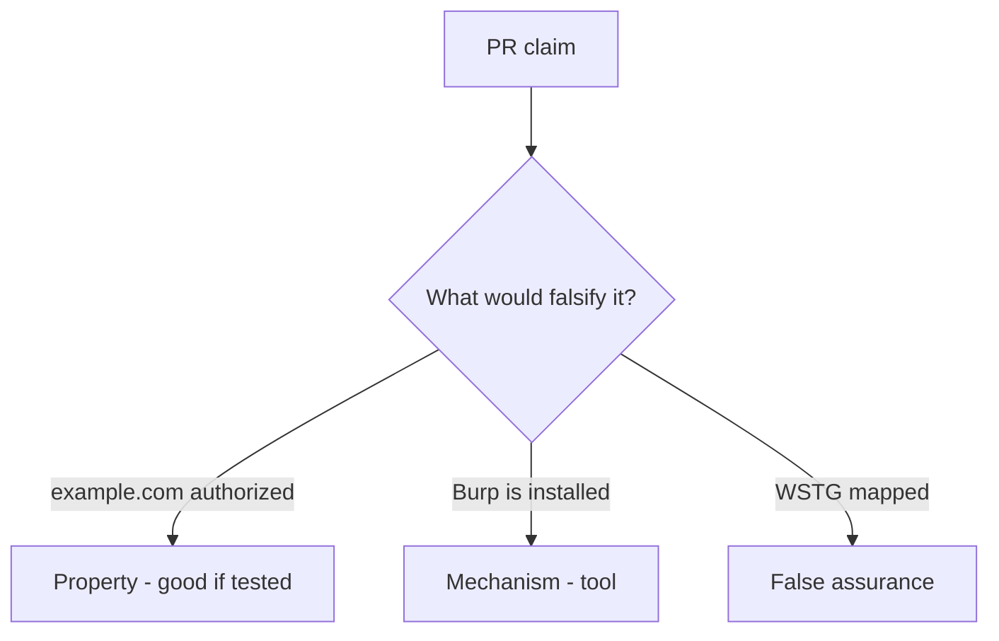

# 0.1-LO-08 — Review any-URL-in-scope as a PR

**Kind:** code-review
**Loop step:** Review
**Standards:** CSF 2.0 GV. WSTG 4.2 as catalogue.

## Review the fixture as if it were the course proxy helper

Review `labs/0.1/0.1-orientation/vulnerable/` as a SecureCollab PR. Intended findings live only in `content/assessment/keys/0.1.md` — not here.

## Mental model: property, mechanism, or false assurance

Seeded smells (label them yourself; do not open the keys file):

- Any URL the proxy can open
- No stop when a redirect leaves 127.0.0.1
- Live-target language in a learner note
- Quiz score treated as permission to scan

Also reject: fetching example.com, keys in lessons, claiming Gate 0.

## Misconceptions

- If it has a login page it is a lab
- WSTG chapter titles are the syllabus
- Defensive learning requires attacking strangers

## Practice

Write three review notes. Tie at least one to `test_public_host_is_out_of_scope`.

## Transfer

Contractor PR that “added WSTG and Burp” without a host allow-list is incomplete.
