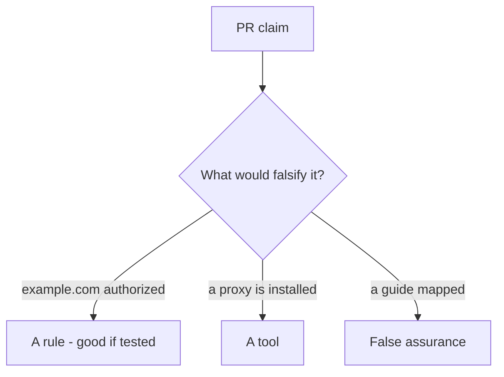

# Would you merge this “any URL is in scope”?

**Kind:** code-review
**Loop step:** Review
**Standards:** CSF 2.0 GV. WSTG 4.2 as catalogue, not a licence.

## Review the practice files as if they were the course helper

Review `labs/0.1/0.1-orientation/vulnerable/` as a pull request for a course tool. Check whether `target_is_authorized` still returns true for a public host.

Wait until someone has looked at your review before opening the keys.

## Picture: any URL the proxy can open

**Any URL the proxy can open**.

A public host still has to be denied. If the change never checks a hostname allow-list, that leftover path is still open.

## Problems to find (name them yourself)

- Any URL the proxy can open
- No stop when a redirect leaves 127.0.0.1
- Live-target language in a learner note
- A quiz score treated as permission to scan

Also reject: fetching example.com; keys in lessons; claiming the first check-in; “it has a login page”; robots.txt as permission; a job title as a permit.

## Common mix-ups

- If it has a login page it is a lab
- Testing-guide chapter titles are the course
- Defensive learning requires attacking strangers
- The computer answering is permission
- A cloud Juice Shop you found is in-scope because the project is “official training”

## Practice

Write the review that blocks this change. Mention `test_public_host_is_out_of_scope`.

## Use it somewhere new

A contractor change that “added the guide and a proxy” without a host allow-list is a skipped-check review. Name the independent falsehood that would still keep `example.com` false.

## What this page is not doing

Do not merge by adding a comment “do not scan production.” That comment is leftover risk without an owner. Do not fetch a public host to prove the finding.
