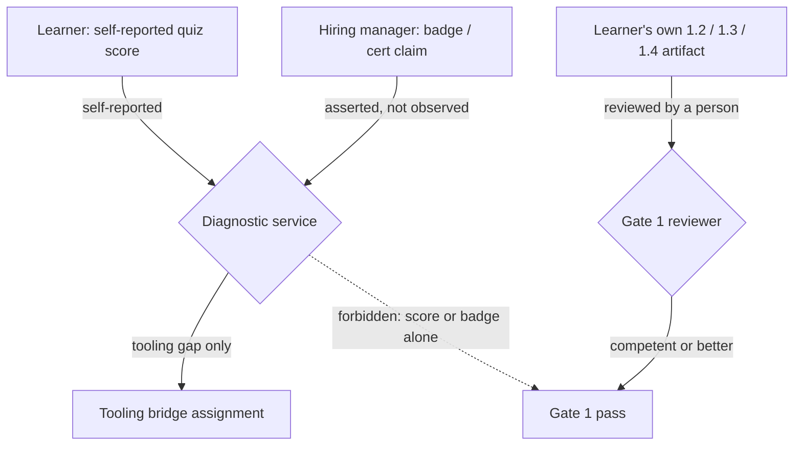

# A diagnostic score cannot satisfy Gate 1's evidence requirement

**Kind:** concept-model
**Loop step:** 1 Property
**Standards:** NIST SP 800-181 Rev. 1 (final, 16 Nov 2020) — "Secure Systems Development" is a NICE work role, used here only as informative placement vocabulary. NIST CSF 2.0 (final) `GV` as an outcome-taxonomy label, not a control this module implements. W3C WCAG 2.2 Success Criterion 1.4.1 Use of Color (Level A): "Color is not used as the only visual means of conveying information, indicating an action, prompting a response, or distinguishing a visual element."

A diagnostic score, however high, cannot satisfy Gate 1's evidence requirement. That is this module's first claim, and everything else in it exists to keep some later edit from quietly reopening it. Formally: `quiz_score_grants_phase1_skip(score)` must return `False` for every integer you could pass it, including 100. If you can find a score at which it should return `True`, you have found a way to make this claim false, and the claim is wrong. This is the shape every claim in this module takes — a falsifiable sentence, not a slogan — and it is worth being precise about why a percentage cannot do what people keep trying to make it do.

## What a score is evidence of, and what it is not

A placement quiz produces a number by scoring a set of multiple-choice or short-answer responses against a key. That number is real evidence of something: it tells you how many of those specific items this specific person answered the way the key expected, at the moment they took it. It is not evidence of a different thing entirely — whether the same person can look at SecureCollab's invite-acceptance endpoint and write a rule that denies an action unless the calling user's authority was checked for that exact object, which is what module [1.2 Authority and protection](../../../1/1.2/lessons/01-property.md) requires as its own Gate 1 evidence, or whether they can draw a trust-boundary diagram that survives a reviewer's questions, which is [1.3 Trust boundaries and attack surface](../../../1/1.3/lessons/01-property.md)'s. A percentage and an authority map are different kinds of evidence because they are produced by different processes and checked by different means: the percentage comes from a scoring engine comparing strings, and the map comes from a person reasoning about a specific system, reviewable by another person who can ask "what if the caller isn't the note's owner but is in the same company?" and expect a real answer. No amount of the first kind of evidence adds up to the second kind, in the same way that no number of correct answers on a driving-theory quiz adds up to a road test — the two are not on the same scale, so there is no threshold on the quiz's scale at which the road test's answer changes.

Trace the fixed function against a handful of scores and the shape is visible directly, rather than only asserted:

```python
quiz_score_grants_phase1_skip(0)    # False
quiz_score_grants_phase1_skip(79)   # False
quiz_score_grants_phase1_skip(80)   # False -- the old vulnerable file's threshold
quiz_score_grants_phase1_skip(100)  # False
```

Nothing distinguishes the fourth call from the first three — no branch, no special value, no "unless it's a perfect score" carve-out. That is what "false for every score" looks like in code, as opposed to "false for the scores this example happened to try."

This is why the claim has to be "false for every score" rather than "false above 100" or some other boundary. A threshold implies the two measurements are commensurable — that enough of the first kind eventually stands in for the second. It does not. `quiz_score_grants_phase1_skip` fixes this by never reading the score in any comparison: not `score < 100`, not `score > 100`, nothing. There is no number this function treats specially, which is a stronger property than "the function currently returns False for the scores we tested."

## What must be trusted, and what changes when the claim changes

For this claim (C1) to hold in practice, you have to trust a short, specific list: that the diagnostic's scoring engine reports the number it actually computed, that quiz items are not themselves production secrets whose disclosure matters, and that whoever wired the skip decision into the course's routing logic actually calls this function rather than a copy of it with a "senior hires start at 90" branch added back in. Notice what is *not* on that list: you do not have to trust that the quiz is hard, that the items are well-written, or that scoring was fair. None of that matters, because the claim does not depend on the score meaning anything — it depends on the score never being read as the thing modules 1.2 through 1.4 require.

That list changes once you move to this module's second claim. [Claim 2](02-model.md) is about a different kind of input entirely — a job title, a vendor certification claim, an LMS "mastery" badge — and what has to be trusted there is not "the scoring engine is honest" but "we have not confused a claim asserted by a different organization, for a different purpose, with something this diagnostic itself observed." A credential might well be true. The trust question is not whether it is true; it is whether *this diagnostic* is the one that established it, because a bridge-skip decision this course cannot audit is a decision this course cannot stand behind, whether or not the credential happens to be accurate this time.

## The trust boundary, drawn



Two authority paths meet at the same decision — whether this learner may treat Phase 1 as satisfied — and they are not equally trustworthy inputs to it. The diagnostic path (top) starts with self-reported or asserted signals and ends, correctly, at a tooling-bridge assignment: a decision about which Git/SQL/HTTP unit to add, not about whether Phase 1's invariants hold. The reviewer path (bottom) starts with an artifact the learner produced and ends at a person's judgment of it. The dotted edge is the one this module exists to keep severed: no route from the diagnostic's inputs to a Gate 1 pass that does not go through a reviewed artifact.

## Attacker capabilities, named and bounded

Two capabilities matter here, and this module deliberately excludes a third. A **hurried learner** can retake a quiz, claim a "fast track," or ask for a skip because the material feels familiar — a real incentive, not a malicious one, but one that produces the same forbidden outcome as an attack would. A **hiring manager with a badge** can assert that a hire is "already senior" and should skip Phase 1 on that basis, substituting a hiring decision for a placement one. What this module does *not* cover is attacking the diagnostic's own infrastructure — forging a score in transit, compromising the scoring engine, or attacking a vendor's LMS to alter a badge. Those are real risks, but they belong to modules about authentication, integrity, and supply chain, not to this one; this module's claims hold even against an honest, uncompromised diagnostic that is simply being asked the wrong question by an honest, uncompromised person.

## What a competent engineer might propose instead, and why each one fails here

A reasonable first instinct is to **raise the threshold** — if 80% is too generous, require 100%, or 100% on a harder quiz. This fails for the reason already given: raising a threshold on the wrong scale does not move you toward the right scale; a perfect score is still a score, and this module's own forbidden outcome is exactly "a perfect score treated as a skip." A second instinct is to **trust credentials from well-known vendors** — a certification from a recognized authority feels more solid than a self-reported number. It fails for the reason [Claim 2](02-model.md) develops: "more solid" is still not "observed by this diagnostic," and a course that cannot audit the vendor's evidence standard cannot stand behind a decision built on it, however reputable the vendor is. A third instinct is to **let an instructor override the skip case by case**, on the theory that human judgment fixes what an automated threshold cannot. This is closer to correct — a person is, after all, what Gate 1's own review requires — but it fails as a substitute for this claim specifically, because an ungoverned override is indistinguishable, in an audit six months later, from a favor: the fix this module actually needs is not "a human can waive it" but "the artifact a human reviews is the same 1.2/1.3/1.4 evidence Gate 1 always required," which is what [Claim 3](04-build.md) makes structural instead of discretionary.

## What comes next

[Claim 2](02-model.md) develops why a credential is not diagnostic evidence, using the same evidence-source reasoning this lesson introduced. [Claim 3](04-build.md) makes the required-module set structural, so that assigning a tooling bridge can never have the side effect of shrinking it. [Claim 4](02-model.md) returns to the NICE work role named in this lesson's Standards line and draws the line between using it as vocabulary and using it as a syllabus. [Claim 5](06-operate.md) covers what the signal that records a denied skip may and may not carry.
