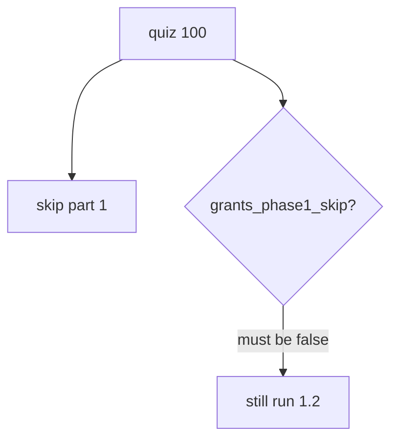
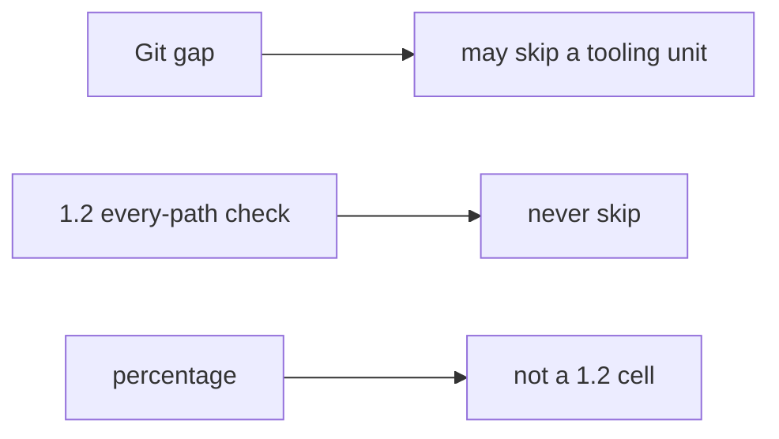

# A quiz score is not a pass on who-is-allowed

**Kind:** concept-model
**Loop step:** 1 Property
**Standards:** NIST SP 800-181r1 NICE (final) as informative role language. CSF 2.0 GV. This course’s Gate 1 evidence rules. WCAG 2.2 1.4.1. A quiz vendor’s score report is not ASVS.

## The rule

You may take a local placement quiz. **Integrity of the learning system** is whether a high score still leaves topic 1.2 (checking every path), check-in 1 evidence, and the who-is-allowed map required. Adaptive paths may skip *orientation reading*, never *the rules*.

> `quiz_score_grants_phase1_skip(100)` must be false. A low score also does not skip.

What must not happen: using a quiz score as permission to skip 1.2 or check-in 1. Fake competency is a safety defect for later practice (keeping companies apart, bad input) if you never wrote the map.

Job-title lists describe jobs. They are not a 1.2 allow cell. An LMS percentage is not a security rule of the notes app.

## Picture: number vs capability



## Picture: a tooling bridge vs a rule



**Mechanism (not the property):** LMS mastery dashboard; a vendor cert screenshot; a job-title mapping.

## Why it happens, what it costs, how you stop it, how you notice, how you recover

| Slice | For this rule |
|---|---|
| Why it happens | A number treated as a capability |
| What has to be true first | `quiz_score_grants_phase1_skip` consults the score |
| Trigger | A hurried learner; a hiring manager with a badge |
| What it costs | Fake competency — later practice without a map |
| How you stop it | Skip only missing tooling units; never skip the who-is-allowed labs |
| How you notice | `phase1_skip_denied`; an audit of skipped ids |
| How you recover | Re-open 1.2; do not back-date check-in 1 |

## What the framework does vs what you still have to check

An LMS will let you mark a topic complete from a percentage. That is this bug.

## What the tool cannot do

- A better quiz still cannot observe whether you can write a deny rule.
- Memorizing 1.2 answers without running the practice.
- Git/SQL/HTTP gaps still need bridges when diagnostics show the skill is missing.

## Can people still use it

Diagnostic UI must not be color-only “green = skip part 1.” Adaptive paths must not hide the accessibility leftovers from 1.4.

## Practice

Name one thing a 100% quiz cannot prove about keeping companies apart. Then run this check:

```
python3 -m pytest labs/0.2/0.2-bridge/tests --impl vulnerable
python3 -m pytest labs/0.2/0.2-bridge/tests --impl fixed
```

The first command must fail. The second must pass.

## Use it somewhere new

A vendor cert used to skip a threat-model review. A clinic onboarding quiz.

## What can still go wrong

Memorized answers; tooling gaps still real. Opening this page does not finish the first check-in.

## What this page is not doing

Live LMS attacks. A job-title list as the course. Check-in 1 from a score.
