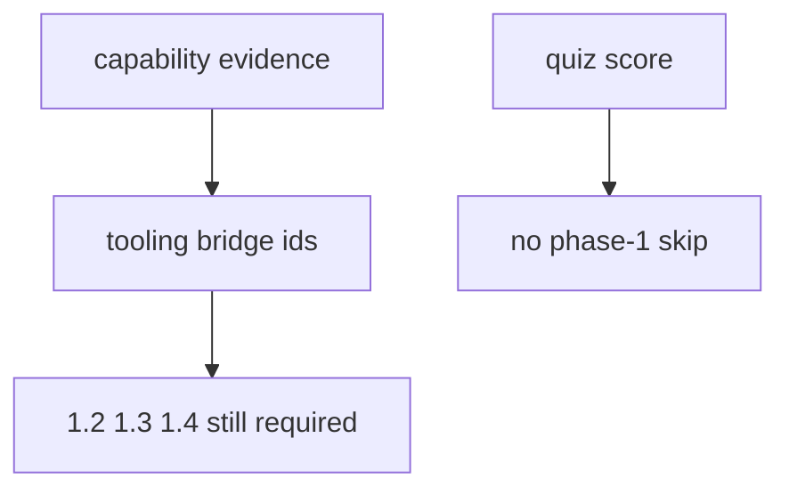

# A diagnostic chooses bridge work, not security clearance

**Kind:** concept-model
**Loop step:** 1 Property

## The rule

A placement diagnostic answers one narrow question: which tooling practice should this learner do next? It may produce `bridge-python`, `bridge-browser`, `bridge-sql`, `bridge-network`, or `bridge-git`. It never creates 1.2, 1.3, or 1.4 evidence, and it never waives Gate 1.

`quiz_score_grants_phase1_skip(100)` must be false. A score is a report; a capability map is evidence about a tool; neither is a security rule.

## Practice

Read the local lab contract and name the record that should be stored for a learner: capability evidence, bridge ids, and separate security evidence. Do not store quiz answers or badges.

## What this page is not doing

It does not score a live LMS, map job titles to clearance, or replace the 1.2 practice.
