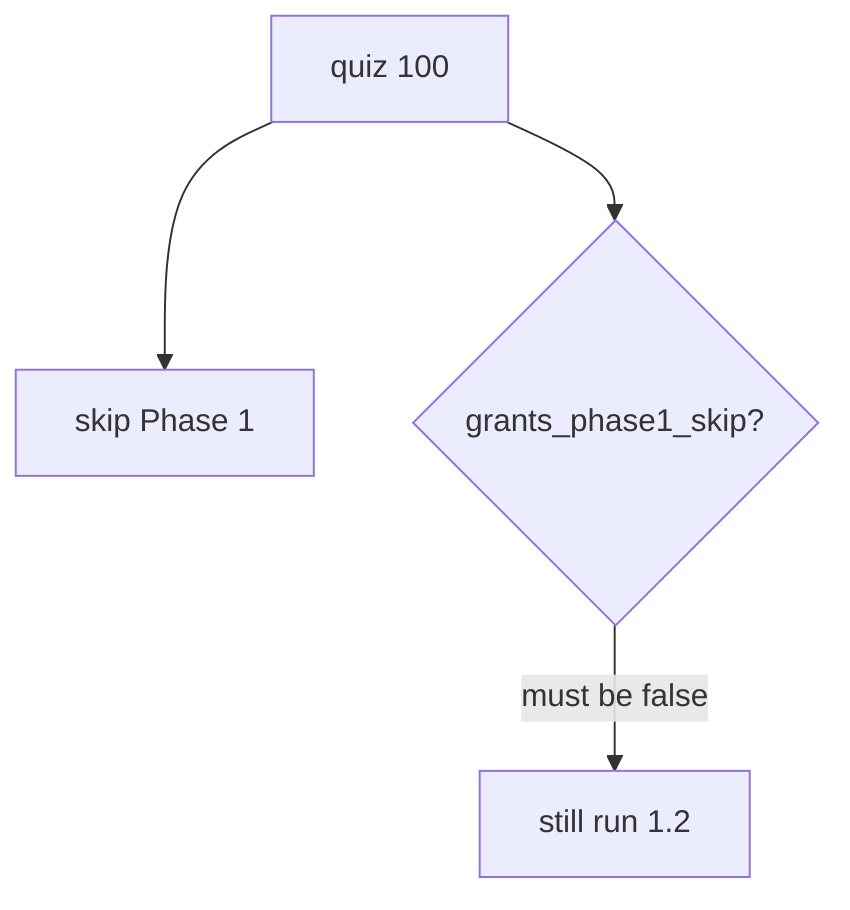
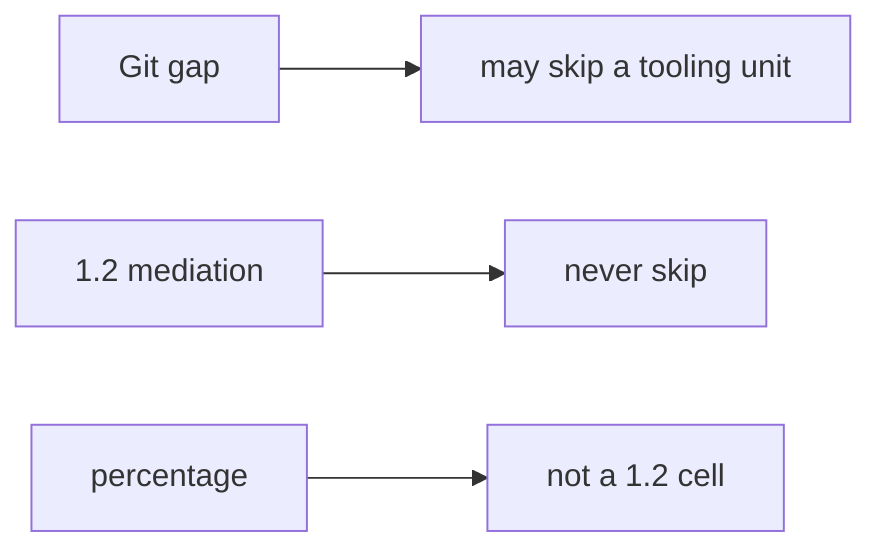

# 0.2-LO-01 — A quiz score is not a 1.2 cell

**Kind:** concept-model
**Loop step:** 1 Property
**Standards:** NIST SP 800-181r1 NICE (final) as informative role language. CSF 2.0 GV. This course’s Gate 1 evidence rules. WCAG 2.2 1.4.1. A quiz vendor’s score report is not ASVS.

## The claim this module owns

Learners may take a local placement quiz. **Integrity of the learning system** is whether a high score still leaves 1.2 complete mediation, Gate 1 evidence, and the authority matrix required. Adaptive paths may skip *orientation prose*, never *invariants*.

> `quiz_score_grants_phase1_skip(100)` must be false. A low score also does not skip.

The forbidden outcome is **quiz score used as authorization to skip 1.2 / Gate 1**. False competency is a safety defect for later labs (4.4 / 6.x without a matrix).

NICE Secure Systems Development competencies describe jobs. They are not a 1.2 allow cell. An LMS percentage is not a security property of SecureCollab.

## Mental model: number vs capability



## Mental model: tooling bridge vs invariant



**Mechanism (not the property):** LMS mastery dashboard; a vendor cert screenshot; NICE work-role mapping.

## Root cause vs impact vs prevention vs detection vs recovery

| Slice | For this property |
|---|---|
| Root cause | A number treated as a capability |
| Preconditions | `quiz_score_grants_phase1_skip` consults the score |
| Trigger | Hurried learner; hiring manager with a badge |
| Impact | False competency — later labs without a matrix |
| Prevention | Skip only missing tooling units; never skip mediation labs |
| Detection | `phase1_skip_denied`; skipped-id audit |
| Recovery | Re-open 1.2; do not back-date Gate 1 |

## Framework defaults versus the skip guarantee

An LMS will let you mark a module complete from a percentage. That is this bug.

## Mechanism limits

- A better quiz still cannot observe whether you can write a deny cell.
- Memorizing 1.2 answers without running the lab.
- Git/SQL/HTTP gaps still need bridges when diagnostics show skill.

## Usability and accessibility

Diagnostic UI must not be color-only “green = skip Phase 1” (WCAG 2.2 1.4.1). Adaptive paths must not hide 1.4 accessibility residuals.

## Practice

Name one thing a 100% quiz cannot prove about tenant isolation. Then run:

```
python3 -m pytest labs/0.2/0.2-bridge/tests --impl vulnerable
python3 -m pytest labs/0.2/0.2-bridge/tests --impl fixed
```

The first command must fail. The second must pass.

## Transfer

Vendor cert used to skip a threat-model review. Clinic onboarding quiz.

## Residual risk

Memorized answers; tooling gaps still real. Gate 0 stays not-attempted.

## Non-goals

Live LMS exploits. NICE as the syllabus. Gate 1 from a score.
