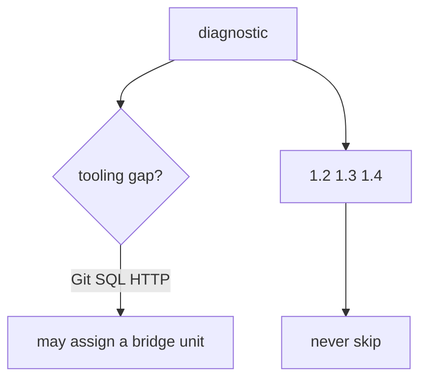
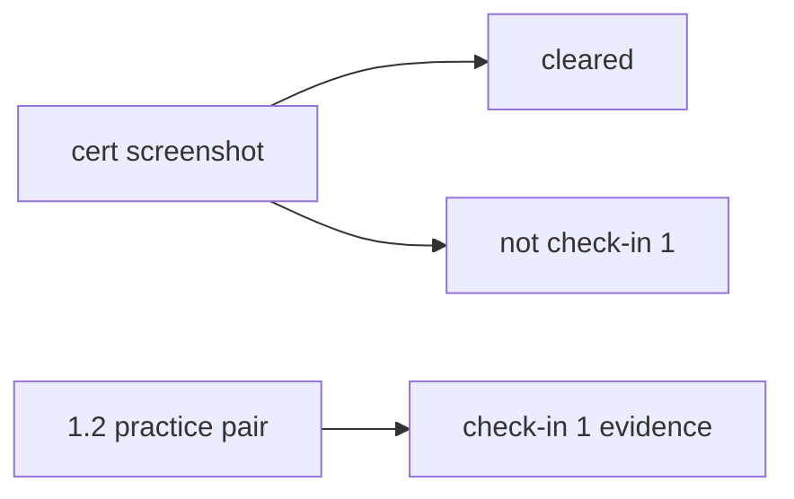

# A tooling skip vs skipping a rule

**Kind:** design-exercise
**Loop step:** 2 Model
**Standards:** NICE SP 800-181r1 as role language. Gate 1 evidence rules of this course.

## Can a second person name what a quiz may skip from your path map?

“They’re advanced” is not this lesson. A reviewable picture names **tooling-bridge ids, required 1.2/1.3/1.4, and check-in 1 evidence**.

Notes-app freeze: local `quiz_score_grants_phase1_skip(score)`. No vendor LMS.

## Picture: two skip classes

## Picture: a badge is not check-in 1

## Step 1: name the pieces

| Piece | This system |
|---|---|
| Subjects | hurried learner; hiring manager |
| Objects | 1.2 cells; tooling units; check-in 1 record |
| Actions | `quiz_score_grants_phase1_skip` |
| Channels | quiz score; LMS |
| What you trust | a skip check that ignores score for part 1 |
| What you do not trust | percentage; badge; job-title mapping |
| State / time | cohort export of skipped ids |
| The rule | integrity of the learning system |

## Step 2: write the rules

| Subject | Object | Action | Decision |
|---|---|---|---|
| score 100 | 1.2 practice | skip | deny |
| Git gap | git-bridge unit | skip part 1 | deny (assign bridge only) |
| badge | check-in 1 | treat as evidence | deny |
| color-only green | skip UI | use as sole signal | deny |

## Practice

Draw the map. Look in `labs/0.2/0.2-bridge`, starting with `diagnostic.py`.

## Use it somewhere new

A clinic onboarding quiz used to skip a threat-model review. Same grain.

## What can still go wrong

Memorized 1.2 answers. Real tooling gaps still need bridges.

## What this page is not doing

Do not treat a famous-bugs list as the definition of security. Keys stay out of lessons.
