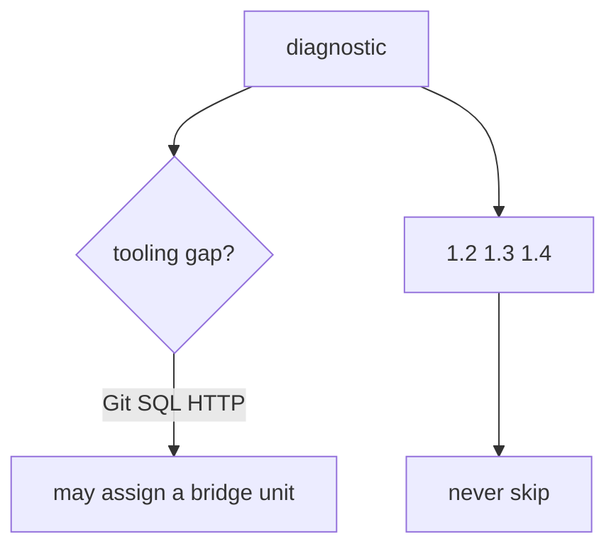
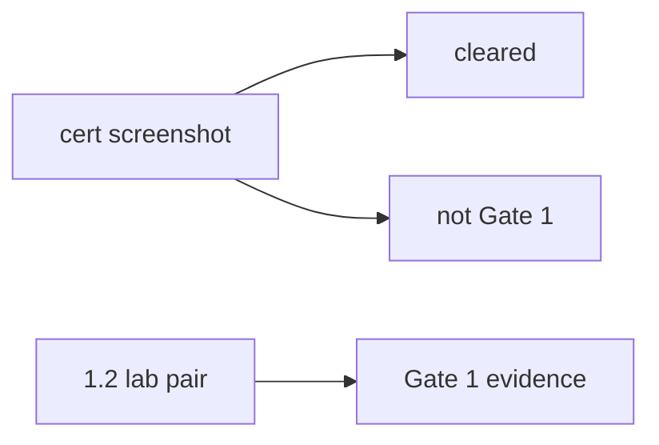

# 0.2-LO-02 — Tooling skip vs invariant skip

**Kind:** design-exercise
**Loop step:** 2 Model
**Standards:** NICE SP 800-181r1 as role language. Gate 1 evidence rules of this course.

## Can a second engineer name what a quiz may skip from your path map?

“They’re advanced” is not this lesson. A reviewable model names **tooling-bridge ids, required 1.2/1.3/1.4, and Gate 1 evidence**.

SecureCollab freeze: local `quiz_score_grants_phase1_skip(score)`. No vendor LMS.

## Mental model: two skip classes

## Mental model: badge is not Gate 1

## Step 1: freeze pieces

| Piece | This system |
|---|---|
| Subjects | hurried learner; hiring manager |
| Objects | 1.2 cells; tooling units; Gate 1 record |
| Actions | `quiz_score_grants_phase1_skip` |
| Channels | quiz score; LMS |
| TCB | skip predicate that ignores score for Phase 1 |
| Untrusted | percentage; badge; NICE mapping |
| State / time | cohort export of skipped ids |
| 1.1 cell | integrity of the learning system |

## Step 2: write cells

| Subject | Object | Action | Decision |
|---|---|---|---|
| score 100 | 1.2 lab | skip | deny |
| Git gap | git-bridge unit | skip Phase 1 | deny (assign bridge only) |
| badge | Gate 1 | treat as evidence | deny |
| color-only green | skip UI | use as sole signal | deny |

## Practice

Draw the map. Point at `labs/0.2/0.2-bridge` file `diagnostic.py`.

## Transfer

Clinic onboarding quiz used to skip threat-model review. Same grain.

## Residual risk

Memorized 1.2 answers. Real tooling gaps still need bridges.

## Non-goals

Top 10 as the definition of security. Keys stay out of lessons.
