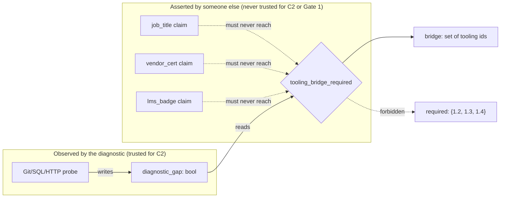

# A credential is not a diagnostic, and a syllabus is not a work role

**Kind:** design-exercise
**Loop step:** 2 Model

Before you can write `tooling_bridge_required` or defend the NICE work-role citation this module leans on, you need names for the pieces that decide a placement outcome, because "the diagnostic decides" hides four different actors making three different kinds of claim. The table below fixes vocabulary for the rest of this module the way [1.3 Trust boundaries and attack surface's model lesson](../../../1/1.3/lessons/02-model.md) fixes vocabulary for trust boundaries generally — by asking a precise question of this system, at this phase, rather than reusing a textbook definition that does not commit to anything.

| Word | Precise question | This system, this phase |
|---|---|---|
| Actor | Who or what initiates a request this module has to decide about? | The learner submitting a score; a hiring manager asserting a credential on a learner's behalf; the diagnostic service itself, running automatically |
| Principal | On whose record does the decision land? | The learner's own placement record — never the hiring manager's, even when the manager is the one who supplied the credential |
| Component | Which piece of code actually makes a decision, as opposed to routing to one? | `quiz_score_grants_phase1_skip`, `tooling_bridge_required`, and `phase1_modules_for_learner` — three separate decisions, not one diagnostic monolith |
| Channel | What carries a claim from actor to component? | A quiz-score field; a `job_title` / `vendor_cert` / `lms_badge` claim field; a `diagnostic_gap` field the diagnostic itself sets |
| Entry point | Where does untrusted input first reach a function that decides something? | The `evidence` dict passed into `tooling_bridge_required`, and the `quiz_score` / `tooling_gaps` / `fast_track` arguments passed into `phase1_modules_for_learner` |
| Trust boundary | Where does a claim stop being "what someone said" and start being "what the diagnostic observed"? | Exactly at the `diagnostic_gap` key — everything else in the evidence dict is asserted, not observed, and this module's claims exist to keep the two from being read the same way |

## Two discriminations worth making explicitly

The first looks like a boundary and is not. When `tooling_bridge_required` hands its result to whatever assigns a Git, SQL, or HTTP bridge unit, it feels like the decision has crossed into a new, more authoritative system — "the bridge assignment engine" sounds like it should re-check things. It should not, and it does not need to: the bridge assignment step consumes exactly the boolean `tooling_bridge_required` already computed, from the same evidence, at the same trust level. Treating the handoff as a fresh trust boundary — as though the bridge engine gets to re-derive trust in a `job_title` claim that the diagnostic already correctly ignored — is how a rejected input quietly re-enters through a second door: nothing about crossing into "assignment" logic changes what kind of evidence a credential is.

The second does not look like a boundary and is. `phase1_modules_for_learner` returns one dictionary with two keys, `required` and `bridge`, computed by one function from one call. It reads as a single decision — "here is this learner's path" — precisely because it is one function call, and that is the trap: `required` and `bridge` are answers to two different questions, built from different evidence standards (C3 permits nothing to shrink `required`; C2 requires positive diagnostic evidence to add to `bridge`), and a maintenance change that "simplifies" the function by letting one branch influence both keys has crossed a boundary that the single Python call does not visually mark at all. The vulnerable file's actual defect — `if quiz_score >= 80 or fast_track: required.discard("1.4")` sitting three lines away from the correctly-computed `bridge` line — is this exact discrimination failure, committed by whoever wrote it.

## What can change between the diagnostic's observation and the decision that uses it

A quiz score cannot go stale in a way that matters, because no score is ever authorization regardless of when it was taken — C1 removes the timing question entirely by removing the score's relevance. `diagnostic_gap` evidence can go stale in a way that does matter: a learner might close a real Git gap the diagnostic observed last week, and the bridge-assignment decision made from last week's evidence is now assigning a unit that is no longer needed. This is a real design question — how often should the tooling diagnostic re-run before its evidence is consumed? — but notice what it is not: it is never a reason to accept a *credential* in place of a fresh diagnostic run. "The evidence might be a week old" argues for re-running the diagnostic, not for replacing it with a self-report, because a week-old observation and an unverified assertion fail in different, non-interchangeable ways: the first is honest evidence that has aged, and the second was never evidence about this learner's actual capability in the first place.

Put the two failure modes side by side and the asymmetry is easier to see. A stale-but-real diagnostic result can only ever be wrong in the direction of "the learner has since closed this gap" — the diagnostic once genuinely observed the problem, and the only thing time can do to that observation is make it out of date. A credential, by contrast, can be wrong in either direction from the moment it is issued: a job title can overstate a specific tooling skill a role never actually exercised, and it can just as easily understate one a person picked up informally that no title reflects. Staleness has one failure mode and a known direction; a credential has two, and this course has no way to tell which one it is looking at.

## Evidence source, traced as a flow



The `required` set has no incoming edge from this diagnostic at all — it is a constant, not a computed value, and the diagram's absence of an edge into it is the point. Everything that *does* flow into a decision is labeled by where it came from, and the three asserted claims are drawn with a forbidden edge into the one decision they must never reach, mirroring `lessons/01-property.md`'s trust-boundary diagram at a finer grain.

## Vocabulary is not a syllabus

The NICE Workforce Framework's Secure Systems Development work role — named in this module's Standards line — describes a job, not an artifact this course grades. A reasonable, narrow use of it is naming which tooling bridge a learner plausibly needs: if a diagnostic observes gaps that map onto that work role's stated tasks, calling the resulting bridge assignment "closing a Secure Systems Development gap" is accurate description, not overreach. The same description used to argue "this learner's diagnostic results align with the Secure Systems Development work role, so 1.2's authority-map requirement is satisfied" is a different act, because nothing about matching a job description implies the reviewed-artifact evidence [1.2 Authority and protection](../../../1/1.2/lessons/01-property.md) requires exists. Table it precisely:

| Use of the work-role text | Legitimate here? |
|---|---|
| Naming which Git/SQL/HTTP bridge a diagnosed gap maps to | Yes — vocabulary, matched to `bridge`, never to `required` |
| Justifying a tooling-bridge skip because "the learner already works this job" | No — a job title is the credential claim [Claim 2](01-property.md) already excludes |
| Treating "meets the Secure Systems Development work role" as equivalent to "passed 1.2" | No — the work role names a job's expectations; 1.2 grades a reviewed artifact against this course's own rubric, not against NICE's |

## Practice

Open `labs/0.2/0.2-bridge/vulnerable/diagnostic.py` and, without running anything yet, mark every line where a value crosses from the "asserted" subgraph above into a decision. There should be exactly the lines this lesson's diagram calls forbidden. Then run:

```text
python3 -m pytest labs/0.2/0.2-bridge/tests --impl vulnerable
```

and confirm the tests that fail are the ones whose evidence crosses that same line.

## What comes next

[Claim 3](04-build.md) makes `required` structurally immune to everything this lesson's flow diagram shows entering `tooling_bridge_required` — a stronger guarantee than "the current code happens to keep them separate." [Claim 5](06-operate.md) asks what the signal that records a denied skip may carry, using the same observed-versus-asserted distinction this lesson built.
