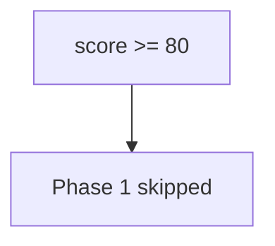

# 0.2-LO-03 — Observe score-as-skip, do not hack an LMS

**Kind:** mechanism-lab
**Loop step:** 3 Break
**Standards:** NICE as vocabulary. Lab policy: local only.

## Authorized scope

`labs/0.2/0.2-bridge` only. Synthetic scores. Do **not** attack a school LMS, vendor quiz, or production HR onboarding as the exercise.

**Forbidden outcome:** Quiz score used as authorization to skip 1.2 / Gate 1.

## Mental model: 80 percent ships



`--impl vulnerable` returns true for scores ≥ 80.

## What to read in the fixture

`vulnerable/diagnostic.py` treats the percentage as a skip grant. Tests require `quiz_score_grants_phase1_skip(100)` is false.

## Root cause vs impact

| Slice | Lab |
|---|---|
| Root cause | A number treated as a capability |
| Impact | False competency for later labs |
| Not the lesson | A NICE dashboard as the definition |

## Practice

```
python3 -m pytest labs/0.2/0.2-bridge/tests --impl vulnerable
```

Record `test_high_quiz_score_is_not_authorization`. Do not probe live LMS hosts.

## Transfer

Clinic onboarding: predict the skip without leaving this directory.

## Non-goals

No live-LMS, vendor-quiz, or public-cert-portal instructions.
