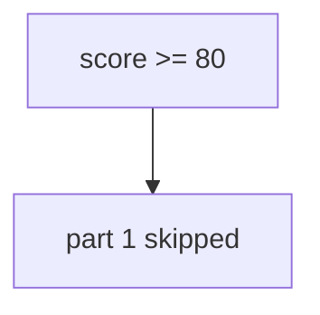

# Watch a high score skip part 1 — do not hack an LMS

**Kind:** mechanism-lab
**Loop step:** 3 Break
**Standards:** NIST SP 800-181r1 NICE (final) as vocabulary, not a leftover hole from topic 1.2; this course’s Gate 1 evidence rules. Lab policy: local only.

## Where you may practice

`labs/0.2/0.2-bridge` only. The practice files check a function called `quiz_score_grants_phase1_skip`. Scores are fake. Do **not** attack a school LMS, vendor quiz, production HR onboarding, or a public cert portal as the exercise. Do not treat a badge screenshot as this practice.

What must not happen: using a quiz score as permission to skip 1.2 or check-in 1. `quiz_score_grants_phase1_skip(100)` returns true.

Picture a hurried learner or hiring manager who can supply a high score — “they’re a senior hire,” “job-title competency,” or “the LMS dashboard is green.” The skip function refuses part-1 rule skips. An LMS percentage, a vendor cert, and a job-title mapping are not that trust.

## Picture: 80 percent ships



`--impl vulnerable` returns true for scores ≥ 80. A number is treated as a capability — not an LMS exploit recipe. You do not need a live quiz. You must not probe a live LMS.

A 100% quiz cannot observe whether you can write a 1.2 deny rule. Check-in 1 evidence is not a percentage.

## What to read in the practice files

`vulnerable/diagnostic.py` `quiz_score_grants_phase1_skip` returns `score >= 80`. Checks:

- `test_high_quiz_score_is_not_authorization` — score 100 must be false
- `test_low_score_does_not_skip` — score 0 must be false

## Why it happens, what it costs, how you stop it, how you notice, how you recover

| Slice | This practice |
|---|---|
| The rule | No quiz score grants a part-1 skip |
| Why it happens | A number treated as a capability |
| What's already wrong | `quiz_score_grants_phase1_skip` consults the score |
| Trigger | `quiz_score_grants_phase1_skip(100)` |
| What it costs | Fake competency — later practice without a map |
| How you stop it | Skip only missing tooling units; never skip the who-is-allowed labs |
| How you notice | `phase1_skip_denied`; an audit of skipped ids |
| How you recover | Re-open 1.2; do not back-date check-in 1 |
| Not the lesson | A job-title dashboard, an LMS mastery badge, or “they’re advanced” |

## What the framework does vs what you still have to check

An LMS will let you mark a topic complete from a percentage. That is this bug class, not the rule. The guarantee here is: **these** files, score 100 → false.

## Practice

```text
python3 -m pytest labs/0.2/0.2-bridge/tests --impl vulnerable
```

Write down the failing check `test_high_quiz_score_is_not_authorization`. Do not weaken the assertion. Do not probe live LMS hosts. A setup error is not proof the rule holds.

## Use it somewhere new

A clinic onboarding quiz used to skip a threat-model review. Predict the skip without leaving this folder. Do not open the clinic LMS.

## Can people still use it

Diagnostic UI must not be color-only “green = skip part 1.” Adaptive paths must not hide the accessibility leftovers from 1.4.

## What this page is not doing

No live-LMS, vendor-quiz, or public-cert-portal instructions. Fake scores only.
