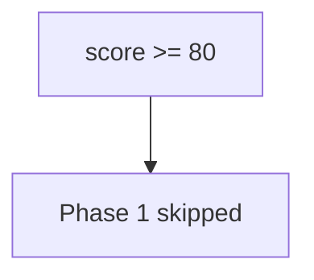

# 0.2-LO-03 — Observe score-as-skip, do not hack an LMS

**Kind:** mechanism-lab
**Loop step:** 3 Break
**Standards:** NIST SP 800-181r1 NICE (final) as vocabulary, not a 1.2 cell; this course’s Gate 1 evidence rules. Lab policy: local only.

## Authorized scope

`labs/0.2/0.2-bridge` only. The fixture is an in-process `quiz_score_grants_phase1_skip` predicate. Synthetic scores. Do **not** attack a school LMS, vendor quiz, production HR onboarding, or a public cert portal as the exercise. Do not treat a badge screenshot as this lab.

**Forbidden outcome:** quiz score used as authorization to skip 1.2 / Gate 1. `quiz_score_grants_phase1_skip(100)` returns true.

Attacker capability in this lab: a hurried learner or hiring manager who can supply a high score. That stands in for “they’re a senior hire,” “NICE SSD competency,” or “LMS mastery dashboard is green.” Trust assumption: the skip function is supposed to refuse Phase 1 invariant skips. An LMS percentage, a vendor cert, and NICE work-role mapping are not in the TCB for this cell.

## Mental model: 80 percent ships



`--impl vulnerable` returns true for scores ≥ 80. The vulnerable tree demonstrates **cause** (a number treated as a capability), not a trophy LMS exploit. Preconditions: an integer score; a helper that compares it to 80 and grants skip. You do not need a live quiz. You must not probe a live LMS.

A 100% quiz cannot observe whether you can write a 1.2 deny cell. Gate 1 evidence is not a percentage.

## What to read in the fixture

`vulnerable/diagnostic.py` `quiz_score_grants_phase1_skip` returns `score >= 80`. Tests:

- `test_high_quiz_score_is_not_authorization` — score 100 must be false
- `test_low_score_does_not_skip` — score 0 must be false

You do not need a new score. The failure of `test_high_quiz_score_is_not_authorization` *is* the evidence.

Do not open the fixed tree yet. Diagnose the cause first.

## Root cause vs impact vs prevention vs detection vs recovery

| Slice | This lab |
|---|---|
| Required property | No quiz score grants a Phase 1 skip |
| Root cause | A number treated as a capability |
| Preconditions | `quiz_score_grants_phase1_skip` consults the score |
| Trigger | `quiz_score_grants_phase1_skip(100)` |
| Impact | False competency — later labs (4.4 / 6.x) without a matrix |
| Prevention | Skip only missing tooling units; never skip mediation labs |
| Detection | `phase1_skip_denied`; skipped-id audit |
| Recovery | Re-open 1.2; do not back-date Gate 1 |
| Not the lesson | A NICE dashboard, an LMS mastery badge, or “they’re advanced” |

## Framework defaults versus the skip guarantee

An LMS will let you mark a module complete from a percentage. That is this bug class, not the property. The application guarantee is: **this** fixture, score 100 → false.

## Practice

```text
python3 -m pytest labs/0.2/0.2-bridge/tests --impl vulnerable
```

Record the failing test `test_high_quiz_score_is_not_authorization`. Do not weaken the assertion. Do not probe live LMS hosts. An environment error is not security evidence.

## Transfer

Clinic onboarding quiz used to skip a threat-model review. Predict the skip without leaving this directory. Do not open the clinic LMS.

## Usability

Diagnostic UI must not be color-only “green = skip Phase 1” (WCAG 2.2 Success Criterion 1.4.1). Adaptive paths must not hide 1.4 accessibility residuals.

## Non-goals

No live-LMS, vendor-quiz, or public-cert-portal instructions. Synthetic scores only.
