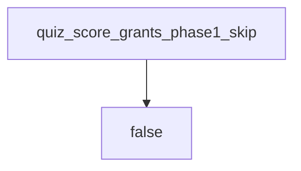

# 0.2-LO-04 — Diagnostics never grant 1.2 or Gate 1

**Kind:** design-exercise
**Loop step:** 4 Build
**Standards:** This course’s Gate 1 evidence rules. NICE as tooling language.

## Structural means the skip function ignores the score for Phase 1

`quiz_score_grants_phase1_skip` must return false for every score. Fail-safe: diagnostics cannot mint 1.2 cells. A Git-bridge assignment may *accompany* the quiz; it is a different function.

## Mental model: always false for Phase 1



Do not accept “they’re a senior hire” as membership.

## Why this restores the cell

| After the fix | Must be true |
|---|---|
| score 100 | false |
| score 0 | false |

## What this is not

NICE competency completion. LMS mastery. Gate 0 / Gate 1. ASVS coverage.

Tooling-bridge skips remain allowed **when a separate diagnostic shows a Git/SQL/HTTP gap** — not because the Phase 1 quiz was high.

## Practice

Name who can assign a tooling bridge. Run:

```
python3 -m pytest labs/0.2/0.2-bridge/tests --impl fixed
```

Must pass.

## Transfer

Clinic: refuse a 100% onboarding quiz as a threat-model skip the same way.

## Residual risk

Memorized answers; real tooling gaps still need bridges.
