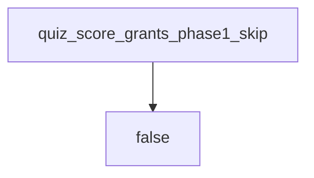

# Diagnostics never grant 1.2 or check-in 1

**Kind:** design-exercise
**Loop step:** 4 Build
**Standards:** This course’s Gate 1 evidence rules. NICE as tooling language, not a 1.2 cell. CSF 2.0 GV as outcome labels.

## The skip function ignores the score for part 1

`quiz_score_grants_phase1_skip` must return false for every score. That means the check does not branch on the number — not a comment “seniors may skip,” not an LMS mastery flag, not a job-title checkbox, not a color-only green badge.

The smallest repair for this course’s placement bridge is: diagnostics cannot mint 1.2 cells. A Git-bridge assignment may *accompany* the quiz; it is a different function, keyed off a tooling diagnostic, not off 80%. If you are unsure whether a unit is a rule, do not skip it.

## Picture: always false for part 1



The repaired files return `False` unconditionally. Do not accept “they’re a senior hire” as membership. Do not accept a vendor cert screenshot as check-in 1. Tooling-bridge skips remain allowed **when a separate diagnostic shows a Git/SQL/HTTP gap** — not because the part-1 quiz was high.

## Why this fix works

| After the fix | Must be true |
|---|---|
| score 100 | false |
| score 0 | false |
| score 80 | false (the broken threshold is gone) |

Check-in 1 still requires 1.2 / 1.3 / 1.4 evidence. This check does not mint that evidence. It only refuses the skip.

## What this is not

Job-title competency completion. LMS mastery. Check-in 0 / check-in 1. An industry list as coverage. A better quiz still cannot observe whether you can write a deny cell. Memorizing 1.2 answers without running the practice remains leftover risk.

## What the tool cannot do

- A 100% quiz cannot prove companies stay apart.
- Adaptive paths can still hide 1.4 if someone wires skip to “part 1 complete” — keep 1.4 required.
- Real Git/SQL/HTTP gaps still need bridges; those bridges must not look like 1.2 skips.

## Practice

Name who can assign a tooling bridge (instructor / diagnostic of a tooling gap — not the quiz). Run:

```text
python3 -m pytest labs/0.2/0.2-bridge/tests --impl fixed
```

Must pass.

## Use it somewhere new

Clinic: refuse a 100% onboarding quiz as a threat-model skip the same way. Vendor cert used to skip a design review: same always-false for the rule unit.

## What can still go wrong

Memorized answers; real tooling gaps still need bridges; color-only skip UI; 1.4 hidden by a “fast track.”

## Can people still use it

Do not encode skip as green-only. Keyboard users must still reach 1.2 and 1.4.
