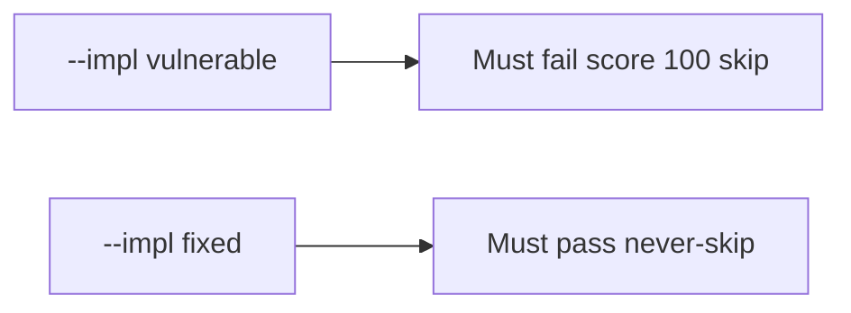

# A perfect quiz score must not skip the next part

**Kind:** verification-lab
**Loop step:** 5 Verify
**Standards:** Gate 1 evidence rules of this course. NICE is vocabulary, not the check.

## Check it

Calling someone advanced does not skip part 1. A 100% LMS tile is a dashboard number. `quiz_score_grants_phase1_skip(100)` has to be false. Leftover: a 100 quiz still skips part 1. Repair keeps the skip false. Do not hack an LMS; the integer is enough.

## Picture: the broken files must fail on score 100 skip

The failing observation on `--impl vulnerable` is **score 100 skip**. A green collection count can hide that skip.



| Mode | Must show for this topic |
|---|---|
| Normal | After the fix, score 0 is still false (`test_low_score_does_not_skip`) |
| The bad case | score 100 → false; the broken files must fail that assertion |
| Failure | A missing diagnostic defaults to no skip (these files always return a bool) |
| Not claimed | You can write a deny rule; Git/SQL/HTTP gaps are gone; 1.4 was taught; check-in 1 is done |

The checks are in `labs/0.2/0.2-bridge/tests/test_diagnostic.py`. The first one is there so a high score treated as a 1.2 skip still fails.

```text
python3 -m pytest labs/0.2/0.2-bridge/tests --impl vulnerable
python3 -m pytest labs/0.2/0.2-bridge/tests --impl fixed
```

A low quiz score that does not skip part 1 may pass on both sides. If the broken files do not fail the score-100 assertion, the practice is miswired — fix the wiring, not the assertion.

## What the checks do not prove

- You can write a deny rule (that is the 1.2 practice)
- Git/SQL/HTTP gaps are gone
- 1.4 accessibility was taught
- Job-title competency
- Check-in 0 or check-in 1 evidence

## Practice

Call `quiz_score_grants_phase1_skip(100)`. A `return False` substring is the source text, not the skip.

## Use it somewhere new

An onboarding quiz that exists is a form, not a 100% skip of part 1. Do not run a test that logs into the clinic LMS.

## What this page is not doing

Do not add a live LMS. Do not paste quiz item text (it can leak practice keys). Keys stay out of this file. Opening this page does not finish check-in 1.
