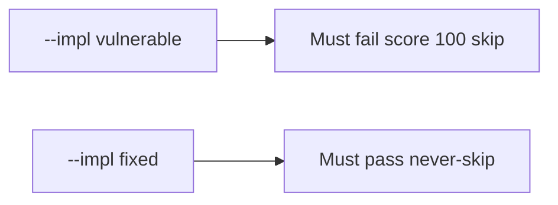

# 0.2-LO-05 — Evidence is quiz skip denied, then a passing pair

**Kind:** verification-lab
**Loop step:** 5 Verify
**Standards:** Gate 1 evidence rules of this course.

## An invariant that cannot fail a test is still a slogan

“They’re advanced” is not evidence. The oracle is the local pair. Do not hack an LMS.

## Mental model: vulnerable must fail: score 100 skip

The failing observation on `--impl vulnerable` is **score 100 skip**. A passing collection count is not this cell.



| Case | Must show |
|---|---|
| Negative / abuse | score 100 → false |
| Normal | score 0 → false |
| Not claimed | NICE dashboard; Gate 1 |

```
python3 -m pytest labs/0.2/0.2-bridge/tests --impl vulnerable
python3 -m pytest labs/0.2/0.2-bridge/tests --impl fixed
```

Honest low-score tests may pass on both.

## What the tests do not prove

- The learner can write a deny cell (that is the 1.2 lab)
- Git/SQL/HTTP gaps are gone
- 1.4 accessibility was taught

## Practice

Execute both implementations. Map each test to an LO-02 cell.

## Transfer

Clinic: a test that only asserts “onboarding quiz exists” is not this cell.
