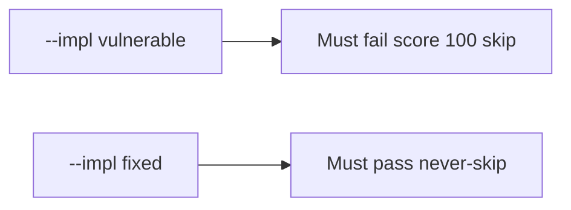

# A perfect quiz score must not skip the next part

**Kind:** verification-lab
**Loop step:** 5 Verify
**Standards:** Gate 1 evidence rules of this course. NICE is vocabulary, not the oracle.

## Check it

“They’re advanced” is not evidence. “LMS mastery is 100%” is a tool observation. The check is: `quiz_score_grants_phase1_skip(100)` is false. That must be **false** on `--impl vulnerable` (the helper returns true) and **true** on `--impl fixed`. Do not hack an LMS; the integer is enough.

## Picture: the broken files must fail on score 100 skip

The failing observation on `--impl vulnerable` is **score 100 skip**. A passing collection count is not this check.



| Mode | Must show for this topic |
|---|---|
| Normal | After the fix, score 0 is still false (`test_low_score_does_not_skip`) |
| The bad case | score 100 → false; the broken files must fail that assertion |
| Failure | A missing diagnostic defaults to no skip (these files always return a bool) |
| Not claimed | You can write a deny rule; Git/SQL/HTTP gaps are gone; 1.4 was taught; check-in 1 is done |

The checks live in `labs/0.2/0.2-bridge/tests/test_diagnostic.py`. The first one is there so a high score treated as a 1.2 skip cannot sneak through.

```text
python3 -m pytest labs/0.2/0.2-bridge/tests --impl vulnerable
python3 -m pytest labs/0.2/0.2-bridge/tests --impl fixed
```

Honest low-score tests may pass on both. If the broken files do not fail the score-100 assertion, the practice is miswired — fix the wiring, not the assertion.

## What the checks do not prove

- You can write a deny rule (that is the 1.2 practice)
- Git/SQL/HTTP gaps are gone
- 1.4 accessibility was taught
- Job-title competency
- Check-in 0 or check-in 1 evidence

Write those down as leftover risk or later topics, not as silent passes.

## Practice

Run both versions this session. Write the fail/pass pair next to your matrix row. Reject a “test” that only greps `return False` in a string without calling `quiz_score_grants_phase1_skip(100)`.

## Use it somewhere new

A clinic example: a test that only asserts “onboarding quiz exists” is not this check. A test that logs into the clinic LMS is out of scope.

## What this page is not doing

Do not add a live LMS. Do not paste quiz item text (it can leak practice keys). Keys stay out of this file. Opening this page does not finish check-in 1.
