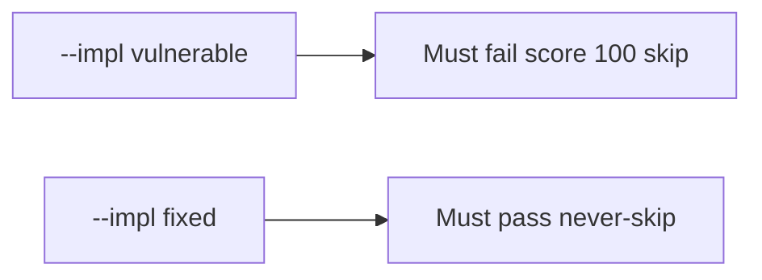

# 0.2-LO-05 — Evidence is quiz skip denied, then a passing pair

**Kind:** verification-lab
**Loop step:** 5 Verify
**Standards:** Gate 1 evidence rules of this course. NICE is vocabulary, not the oracle.

## An invariant that cannot fail a test is still a slogan

“They’re advanced” is not evidence. “LMS mastery is 100%” is a mechanism observation. The oracle is: `quiz_score_grants_phase1_skip(100)` is false. That observation must be **false** on `--impl vulnerable` (the helper returns true) and **true** on `--impl fixed`. Do not hack an LMS; the integer is enough.

## Mental model: vulnerable must fail: score 100 skip

The failing observation on `--impl vulnerable` is **score 100 skip**. A passing collection count is not this cell.



| Mode | Must show for this module |
|---|---|
| Normal | After the fix, score 0 is still false (`test_low_score_does_not_skip`) |
| Negative / abuse | score 100 → false; vulnerable must fail that assertion |
| Failure | Missing diagnostic defaults to no skip (this fixture always returns a bool) |
| Not claimed | The learner can write a deny cell; Git/SQL/HTTP gaps are gone; 1.4 was taught; Gate 1 complete |

Lab tests: `test_high_quiz_score_is_not_authorization` and `test_low_score_does_not_skip` in `labs/0.2/0.2-bridge/tests/test_diagnostic.py`. The first test is a **forbidden-outcome** test: a high score treated as a 1.2 skip is not allowed to count as a passing control.

```text
python3 -m pytest labs/0.2/0.2-bridge/tests --impl vulnerable
python3 -m pytest labs/0.2/0.2-bridge/tests --impl fixed
```

Honest low-score tests may pass on both. Map each test to an LO-02 cell. If vulnerable does not fail the score-100 assertion, the lab is miswired—fix the wiring, not the assertion.

## What the tests do not prove

- The learner can write a deny cell (that is the 1.2 lab)
- Git/SQL/HTTP gaps are gone
- 1.4 accessibility was taught
- NICE competency
- Gate 0 or Gate 1 evidence

Record those as residuals or later modules, not as silent passes.

## Practice

Execute both implementations this session. Write the fail/pass pair next to the matrix row. Reject a “test” that only greps `return False` in a string without calling `quiz_score_grants_phase1_skip(100)`.

## Transfer

Clinic: a test that only asserts “onboarding quiz exists” is not this cell. A test that logs into the clinic LMS is out of scope.

## Non-goals

Do not add a live LMS. Do not paste quiz item text (it can leak lab keys). Keys stay out of this file. Gate 1 stays not-attempted.
