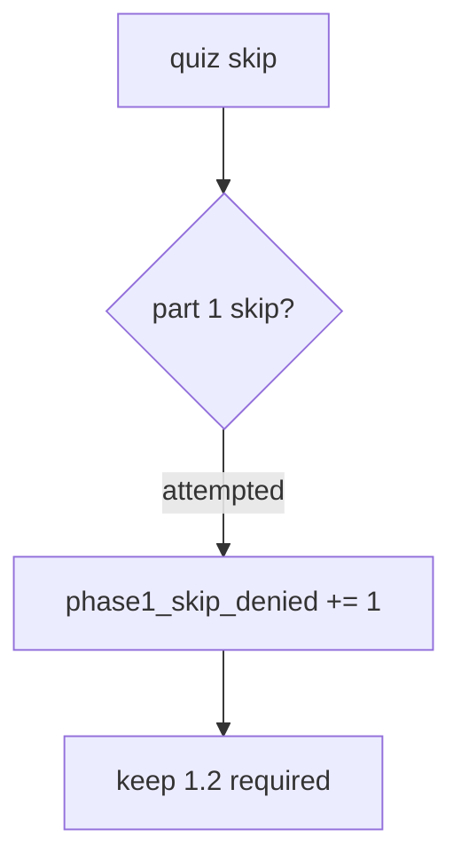

# Notice a denied skip without back-dating check-in 1

**Kind:** operations-exercise
**Loop step:** 6 Operate
**Standards:** NIST CSF 2.0 (final) DE/RS/RC as outcome labels. CSF names outcomes; it does not mint Gate 1.

## Fixing it once is not enough

A new “fast-track seniors” flag can reintroduce score-as-skip. Pair noticing with recovery. Do not back-date check-in 1. Do not log quiz item text if it leaks practice keys. Do not treat a badge screenshot as recovery evidence.

## Picture: a denied skip is a signal



| Outcome | This topic |
|---|---|
| Notice | `phase1_skip_denied`; the check pair is still red/green for score 100 |
| Signal | learner id, requested skip; never quiz item text if it leaks practice keys |
| Recover | Re-open 1.2; do not back-date check-in 1; do not mark 1.4 hidden |
| Leftover | Memorized answers; tooling gaps; color-only skip UI |

A job-title mapping does not prove you can fail a check. Opening this page does not finish the first check-in.

## What the framework does vs what you still have to check

An LMS will happily store “topic complete” from a percentage and export it to HR. That export is not this deny metric. If you paste quiz items or a cert screenshot into the ticket, you have opened a key-leak and a fake check-in 1 cell.

## Practice

```text
log_denied reason=phase1_skip_denied learner=dev-1 requested=1.2
```

Reject any line that includes quiz keys, a badge screenshot, a job-title id treated as done, or “check-in 1 complete.”

## Use it somewhere new

Deny the onboarding skip; do not paste the quiz items into HR. Vendor cert used to skip a threat-model review: same deny, same no-back-date rule.

## Can people still use it

Do not encode the deny as red-only. Keyboard users must still reach 1.2. Adaptive paths must not hide 1.4.

## What this page is not doing

A job-title sticker does not finish this page. Opening this page does not finish the first check-in. Do not instruct live LMS audits.
