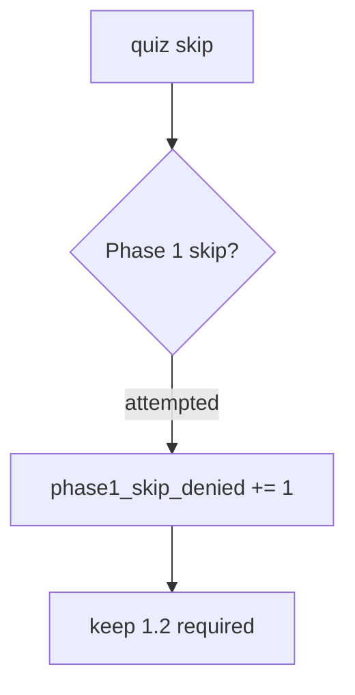

# 0.2-LO-06 — Detect phase1_skip_denied without back-dating Gate 1

**Kind:** operations-exercise
**Loop step:** 6 Operate
**Standards:** NIST CSF 2.0 (final) DE/RS/RC as outcome labels. CSF names outcomes; it does not mint Gate 1.

## Prevention is not absolute

A new “fast-track seniors” flag can reintroduce score-as-skip after the predicate was “set once.” Pair detect and recover. Do not back-date Gate 1. Do not log quiz item text if it leaks lab keys. Do not treat a badge screenshot as recovery evidence.

## Mental model: denied skip is a signal



| Outcome | This module |
|---|---|
| Detect | `phase1_skip_denied`; CI pair still red/green for score 100 |
| Signal | learner id, requested skip; never quiz item text if it leaks lab keys |
| Recover | Re-open 1.2; do not back-date Gate 1; do not mark 1.4 hidden |
| Residual | Memorized answers; tooling gaps; color-only skip UI |

CSF 2.0 names Detect / Respond / Recover. They do not prove 1.2. A NICE work-role name is not the property. Gate 0 stays not-attempted.

## Framework defaults versus the operate guarantee

An LMS will happily store “module complete” from a percentage and export it to HR. That export is not this deny metric. If you paste quiz items or a cert screenshot into the ticket, you have opened a key-leak and a false Gate 1 cell.

## Practice

Write one log line you would accept. Tie it to `labs/0.2/0.2-bridge`.

```text
log_denied reason=phase1_skip_denied learner=dev-1 requested=1.2
```

Reject any line that includes quiz keys, a badge screenshot, a NICE competency id treated as done, or “Gate 1 complete.”

## Transfer

Clinic: deny the onboarding skip; do not paste the quiz items into HR. Vendor cert used to skip a threat-model review: same deny, same no-back-date rule.

## Usability

Do not encode the deny as red-only. Keyboard users must still reach 1.2. Adaptive paths must not hide 1.4 (WCAG 2.2 Success Criterion 1.4.1).

## Non-goals

A NICE work-role name is not the property. Gate 0 stays not-attempted. Do not instruct live LMS audits.
