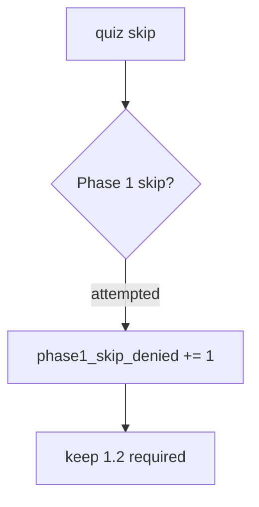

# 0.2-LO-06 — Detect phase1_skip_denied without back-dating Gate 1

**Kind:** operations-exercise
**Loop step:** 6 Operate
**Standards:** NIST CSF 2.0 (final) DE/RS/RC as outcome labels.

## Prevention is not absolute

A new “fast-track seniors” flag can reintroduce score-as-skip after the predicate was “set once.” Pair detect and recover. Do not back-date Gate 1.

## Mental model: denied skip is a signal



| Outcome | This module |
|---|---|
| Detect | `phase1_skip_denied` |
| Signal | learner id, requested skip; never quiz item text if it leaks lab keys |
| Recover | Re-open 1.2; do not back-date Gate 1 |
| Residual | Memorized answers; tooling gaps |

## Practice

Write one log line you would accept. Tie it to `labs/0.2/0.2-bridge`.

```
log_denied reason=phase1_skip_denied learner=dev-1 requested=1.2
```

Reject any line that includes quiz keys, a badge screenshot, or “Gate 1 complete.”

## Transfer

Clinic: deny the onboarding skip; do not paste the quiz items into HR.

## Non-goals

A NICE work-role name is not the property. Gate 0 stays not-attempted.
