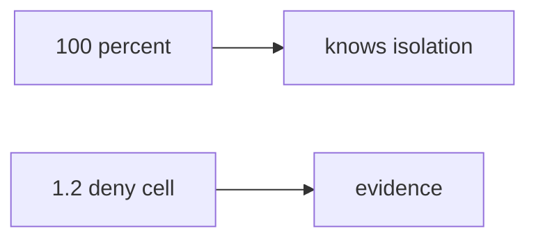

# 0.2-LO-07 — Transfer: clinic onboarding quiz

**Kind:** transfer-challenge
**Loop step:** 7 Transfer
**Standards:** NICE as role language. Gate 1 evidence rules. WCAG 2.2 Success Criterion 1.4.1 if skip is shown in a UI.

## Change the workplace; keep the quiz from meaning 1.2

Do not answer with a Top 10 / CWE / scanner as the definition of security. The course sentence was: `quiz_score_grants_phase1_skip(100)` is false. Rewrite it for a workplace onboarding quiz without changing the fork.

**Prompt:** Onboarding at a clinic-booking SaaS. Also name a vendor cert used to skip a threat-model review.

**Product sketch:** “They scored 100% so skip isolation labs,” plus “NICE SSD competency so Gate 1 is done.”

Rewrite the course sentence. Include:

1. attacker capabilities (hurried new hire or manager with a badge — **not** a live HR LMS attack);
2. trust assumptions (skip predicate is TCB; quiz / NICE / badge / LMS percentage are not);
3. forbidden outcome (`quiz_score_grants_phase1_skip(100)` true, not “unprofessional”);
4. a test idea on a **local** fixture only (no clinic LMS; reuse score 100 → false);
5. residual (tooling gaps, memorized answers, 1.4 hidden by a fast-track);
6. WCAG (green-only skip UI is not evidence; 1.4 must remain reachable).

## Mental model: 100 percent vs deny cell

A percentage is a mechanism observation. A 1.2 deny cell is the evidence. NICE names jobs. An LMS stores numbers. Neither is Gate 1. FastAPI, Next.js, and a quiz vendor’s score report do not observe whether the new hire can write a tenant-B deny cell. Tooling-bridge skips (Git/SQL/HTTP) remain a different function: they must not be keyed off this 100%.

## What graders reject

| Reject | Why |
|---|---|
| “NICE / OSCP / LMS” | Not 1.2 |
| Live clinic LMS | Lab policy |
| “fast learners skip invariants” | This cell |
| Badge screenshot as Gate 1 | False assurance |
| Color-only green skip | WCAG 1.4.1 and a hidden 1.4 residual |

## Practice

One page. No keys. `labs/0.2/0.2-bridge` is the only running system you may break. Do not log into a clinic LMS or a cert vendor portal.

## Non-goals

Live-target walkthroughs. Claiming Gate 0 or Gate 1 from this page. Treating tooling-bridge skips as 1.2 skips.
