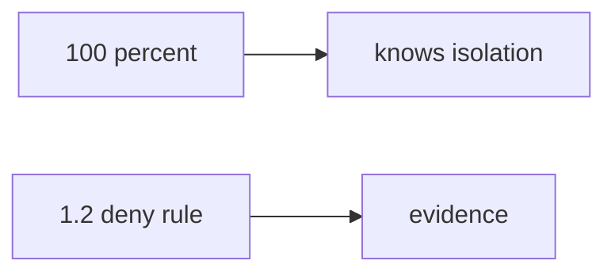

# A clinic onboarding quiz

**Kind:** transfer-challenge
**Loop step:** 7 Transfer
**Standards:** NICE as role language. Gate 1 evidence rules. WCAG 2.2 Success Criterion 1.4.1 if skip is shown in a UI.

## Change the workplace; keep the quiz from meaning 1.2

In this course, `quiz_score_grants_phase1_skip(100)` is false. The same rule has to hold for a workplace onboarding quiz.

Onboarding at a clinic-booking product. Also name a vendor cert used to skip a threat-model review.

“They scored 100% so skip isolation labs,” plus “job-title competency so check-in 1 is done.”

1. who might try (a hurried new hire or manager with a badge — **not** a live HR LMS attack);
2. what you trust (the skip check; not a quiz, a job title, a badge, or an LMS percentage);
3. what must not happen (`quiz_score_grants_phase1_skip(100)` true, not merely “unprofessional”);
4. a check idea on **local** files only (no clinic LMS; reuse score 100 → false);
5. leftover risk (tooling gaps, memorized answers, 1.4 hidden by a fast-track);
6. if skip is shown in a UI, green-only is not evidence; 1.4 must remain reachable.

## Picture: 100 percent vs a deny rule

A percentage is a tool observation. A 1.2 deny rule is the evidence. A job-title list names jobs. An LMS stores numbers. Neither is check-in 1. FastAPI, Next.js, and a quiz vendor’s score report do not observe whether the new hire can write a company-B deny rule. Tooling-bridge skips (Git/SQL/HTTP) remain a different function: they must not be keyed off this 100%.

## What is not good enough

| Reject | Why |
|---|---|
| “A job title / a cert / an LMS” | Not 1.2 |
| Live clinic LMS | Course rules |
| “fast learners skip rules” | This check |
| Badge screenshot as check-in 1 | False assurance |
| Color-only green skip | Accessibility, and a hidden 1.4 leftover |

## Practice

Write one page. Leave the keys closed. `labs/0.2/0.2-bridge` is the only running system you may break. Do not log into a clinic LMS or a cert vendor portal.

## What this page is not doing

Do not try live-target walkthroughs. This page does not finish check-in 0 or check-in 1. Do not treat tooling-bridge skips as 1.2 skips.
