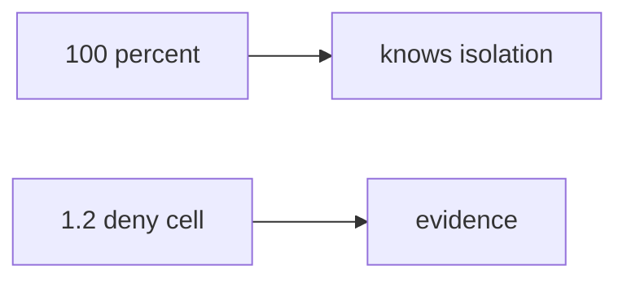

# 0.2-LO-07 — Transfer: clinic onboarding quiz

**Kind:** transfer-challenge
**Loop step:** 7 Transfer
**Standards:** NICE as role language. Gate 1 evidence rules.

## Change the workplace; keep the quiz from meaning 1.2

Do not answer with a Top 10 / CWE / scanner as the definition of security.

**Prompt:** Onboarding at a clinic-booking SaaS. Also name a vendor cert used to skip a threat-model review.

**Product sketch:** “They scored 100% so skip isolation labs,” plus “NICE SSD competency so Gate 1 is done.”

Rewrite the SecureCollab sentence. Include:

1. attacker capabilities (hurried new hire — not a live HR LMS attack);
2. trust assumptions (skip predicate is TCB; quiz/NICE/badge are not);
3. forbidden outcome (`quiz_score_grants_phase1_skip(100)` true, not “unprofessional”);
4. a test idea on a **local** fixture only (no clinic LMS);
5. residual (tooling gaps, memorized answers, 1.4 hidden);
6. WCAG (green-only skip UI).

## Mental model: 100 percent vs deny cell

## What graders reject

| Reject | Why |
|---|---|
| “NICE / OSCP / LMS” | Not 1.2 |
| Live clinic LMS | Lab policy |
| “fast learners skip invariants” | This cell |

## Practice

One page. No keys. `labs/0.2/0.2-bridge` is the only running system you may break.
