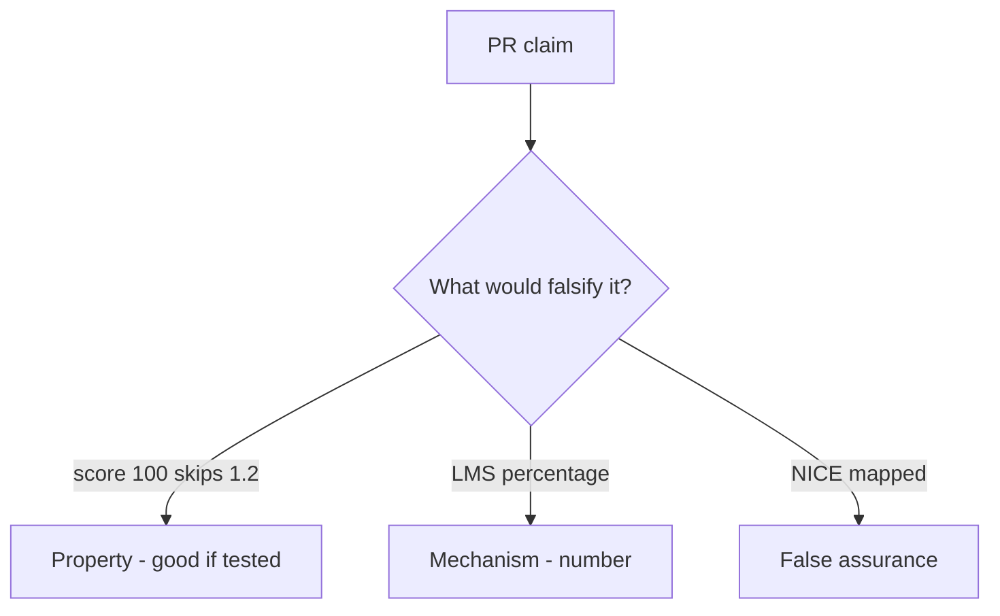

# 0.2-LO-08 — Review quiz-as-skip as a PR

**Kind:** code-review
**Loop step:** Review
**Standards:** NICE as vocabulary. Gate 1 evidence rules.

## Review the fixture as if it were the course placement service

Review `labs/0.2/0.2-bridge/vulnerable/` as a SecureCollab PR. Intended findings live only in `content/assessment/keys/0.2.md` — not here.

## Mental model: property, mechanism, or false assurance

Seeded smells (label them yourself; do not open the keys file):

- `if score >= 80: skip_phase(1)`
- No link from diagnostic to 1.2 evidence
- Badge screenshot as Gate 1
- Adaptive path hides 1.4 accessibility residual

Also reject: live LMS attacks, keys in lessons, claiming Gate 0 or Gate 1.

## Misconceptions

- Placement is a security clearance
- Fast learners skip invariants
- Tool fluency is threat modeling

## Practice

Write three review notes. Tie at least one to `test_high_quiz_score_is_not_authorization`.

## Transfer

Clinic PR that “added an onboarding quiz and NICE mapping” without keeping 1.2 required is incomplete.
